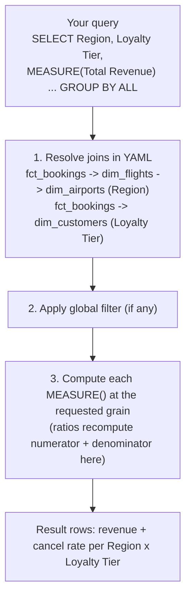
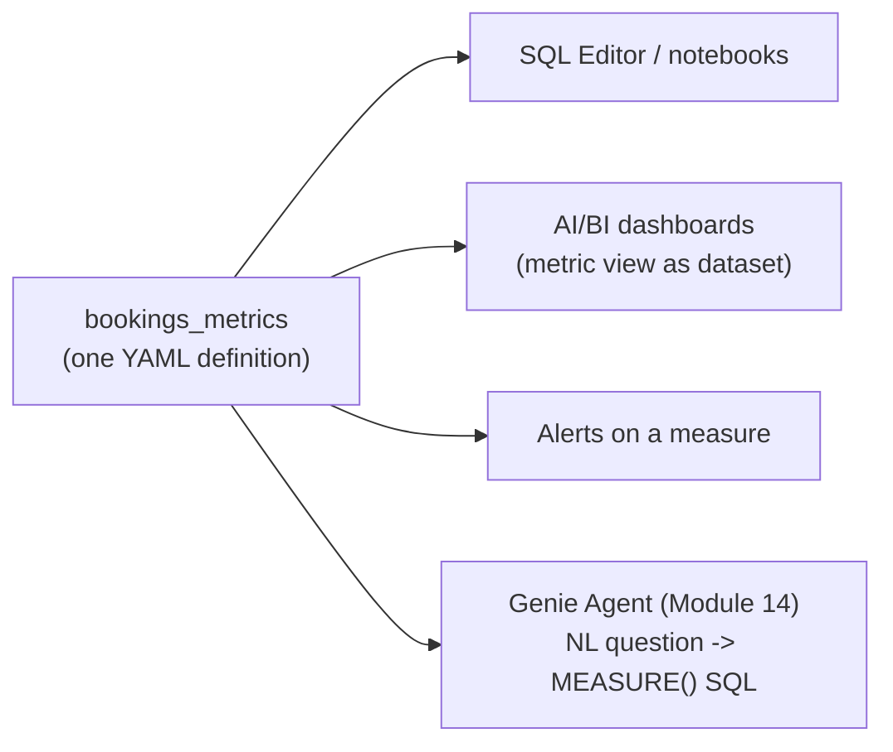

# Querying metric views — a joins tutorial  ·  Module 15 · Topic 15.3 ★  ·  [Hands-on]

> **You are here:** Roadmap Module 15 → 15.3 (cornerstone deep-dive). This is the query half of the module hub `module.md`. Prereqs: the `unity_airways.analytics.bookings_metrics` metric view from 15.2 (built in the lab notebook), and a **Pro or Serverless SQL warehouse** (or DBR 17.2+).

## TL;DR
- Query a metric view with **two rules**: name the **dimensions** you want, and wrap every **measure** in the **`MEASURE()`** function. `SELECT *` is not supported.
- **`GROUP BY ALL`** groups by every dimension you selected; **`ORDER BY`** a measure through its alias.
- **Joins are invisible.** Because `dim_flights` / `dim_customers` / `dim_airports` are joined in the YAML, you ask for `Region` or `Loyalty Tier` with **no JOIN** in your SELECT — the view resolves the star/snowflake path.
- **Filter dimensions in `WHERE`**; to filter *on a measure*, wrap the aggregate query and filter the alias in an outer `SELECT`.
- The same view feeds SQL Editor, AI/BI dashboards, alerts, and the Module 14 **Genie Agent** — one definition, many consumers.

## The problem
- You built one governed metric view. Now every team needs a different cut: finance wants revenue by fare class, ops wants cancellation rate by route, loyalty wants ancillary attach rate by tier, and the exec dashboard wants a monthly trend.
- With raw tables, each of those is a fresh JOIN + GROUP BY, and each analyst risks defining "revenue" or "cancellation rate" slightly differently. That is exactly the drift the metric view exists to kill.
- The skill you need is **querying** the metric view: the small, consistent SQL grammar (`MEASURE()`, `GROUP BY ALL`) that lets everyone pull any slice from the one definition — including dimensions that live in joined tables they never touch directly.

## Why the naive approach fails
- **"Query it like a normal table with `SELECT *`."** Fails outright — metric views reject `SELECT *` and bare measure references, because a measure has no value until you choose a grain.
- **"JOIN the dimension tables in my SELECT to get Region."** Redundant and wrong-headed: the join is already in the YAML. Adding it again double-counts or errors. You name the dimension; the view does the join.
- **"Average the per-route cancellation rate to get the region rate."** The classic ratio bug. Averaging ratios is not the ratio of the totals. A metric-view measure recomputes numerator and denominator at the region grain, so you just ask for `Region` and get the true rate.
- **"Filter a measure in `WHERE`."** `WHERE MEASURE(...) > x` doesn't work — measures aren't available at row-filter time. Filter dimensions in `WHERE`; filter measures in an outer query on the alias.

## Core concepts — the query grammar

- **`MEASURE(name)`** — the required wrapper that evaluates a measure at the current grain. Every measure reference uses it. Alias the result for readable output (``MEASURE(`Total Revenue`) AS revenue``).
- **Dimensions in `SELECT` + `GROUP BY ALL`** — list the dimensions you want to slice by; `GROUP BY ALL` groups by all of them automatically. You can also `GROUP BY 1, 2` explicitly.
- **Backtick-quote names with spaces** — `` `Fare Class` ``, `` `Booking Month` ``. Names without spaces need no backticks but they don't hurt.
- **`WHERE` filters dimensions** — `WHERE Region = 'EMEA'` or `WHERE Booking Month >= '2025-04-01'` (backtick-quote the names in real SQL). The view's global `filter:` (if any) always applies on top.
- **Order and top-N** — `ORDER BY revenue DESC LIMIT 10` using the alias.
- **Casting for display** — measures return their natural type; cast in the SELECT for tidy output (`MEASURE(Total Revenue)::BIGINT`).

## 🗺️ Visual map

**What the engine does with a metric-view query:**



*Takeaway: you write a flat SELECT over dimensions and measures; the engine expands the joins, applies the filter, and aggregates at your grain. The join graph and the ratio math are handled for you.*

**Where the same view goes:**



*Takeaway: every consumer speaks the same `MEASURE()` grammar (or has it generated for them), so the numbers agree across SQL, BI, alerts, and chat.*

---

## Walkthrough 1 — the simplest query  ·  [Hands-on]

Revenue and booking volume by fare class:

```sql
SELECT
  `Fare Class`,
  MEASURE(`Total Revenue`) AS total_revenue,
  MEASURE(`Booking Count`)  AS bookings
FROM unity_airways.analytics.bookings_metrics
GROUP BY ALL
ORDER BY total_revenue DESC
```

- `Fare Class` is the only dimension → one row per fare class.
- `GROUP BY ALL` = group by `Fare Class` (the sole non-measure column).
- **How to verify:** four rows (Economy, Premium, Business, First); `total_revenue` sums to the same grand total as ``SELECT MEASURE(`Total Revenue`) FROM ... GROUP BY ALL`` with no dimension. If the totals match, re-aggregation is working.

## Walkthrough 2 — time dimensions  ·  [Hands-on]

The metric view exposes `Booking Month` (a `DATE_TRUNC('MONTH', booking_date)` dimension), so a trend needs no date math in the query:

```sql
SELECT
  `Booking Month`,
  MEASURE(`Total Revenue`) AS revenue,
  MEASURE(`Booking Count`) AS bookings
FROM unity_airways.analytics.bookings_metrics
WHERE `Booking Month` >= DATE'2025-01-01'
GROUP BY ALL
ORDER BY `Booking Month`
```

- Filtering on the **dimension** (`Booking Month`) in `WHERE` is the fast, correct way to scope a time range.
- For "last quarter by fare class" (the Module 14 Genie question), add `Fare Class` and filter `Booking Quarter`:

```sql
SELECT
  `Fare Class`,
  MEASURE(`Total Revenue`) AS revenue
FROM unity_airways.analytics.bookings_metrics
WHERE `Booking Quarter` = DATE'2025-04-01'   -- start of the quarter (DATE_TRUNC('QUARTER', ...))
GROUP BY ALL
ORDER BY revenue DESC
```

> 💡 **TIP:** Expose common time grains (`Booking Month`, `Booking Quarter`) as dimensions in the YAML rather than making consumers write `DATE_TRUNC` every time. It keeps queries short and guarantees everyone buckets time the same way.

## Walkthrough 3 — the joins tutorial (the cornerstone) ·  [Hands-on]

This is the heart of 15.3: pulling dimensions that live in **joined** tables, without writing a single JOIN.

**`Loyalty Tier` comes from `dim_customers`. `Region` comes from `dim_airports`, reached *through* `dim_flights` (a snowflake join).** Both are just dimension names to the query:

```sql
-- Revenue and cancellation rate by region and loyalty tier — no JOIN in sight
SELECT
  `Region`,
  `Loyalty Tier`,
  MEASURE(`Total Revenue`)      AS revenue,
  MEASURE(`Cancellation Rate`)  AS cancel_rate
FROM unity_airways.analytics.bookings_metrics
GROUP BY ALL
ORDER BY revenue DESC
```

- The YAML declared: `fct_bookings → dim_flights → dim_airports` (nested, for `Region`) and `fct_bookings → dim_customers` (for `Loyalty Tier`). The query just names `Region` and `Loyalty Tier`.
- **Cancellation rate is a ratio measure** — `COUNT(1) FILTER (WHERE status='cancelled') / COUNT(1)`. At the `Region × Loyalty Tier` grain the engine recomputes both counts, so each `cancel_rate` is a true rate for that cell — never an average of route rates.
- **How to verify the join resolved:** every row has a non-null `Region` and `Loyalty Tier`, and `cancel_rate` is between 0 and 1. If `Region` is null, the airport snowflake join key is off; if the query errors on `Region`, you're likely on a runtime below DBR 17.1 (nested joins) or 17.2 (v1.1).

**"Which routes have the highest cancellation rate"** (Module 14 Genie question) — group by origin and destination, both from `dim_flights`:

```sql
SELECT * FROM (
  SELECT
    `Origin Airport`,
    `Dest Airport`,
    MEASURE(`Cancellation Rate`) AS cancel_rate,
    MEASURE(`Booking Count`)     AS bookings
  FROM unity_airways.analytics.bookings_metrics
  GROUP BY ALL
)
WHERE bookings >= 5          -- filter ON a measure: do it in an outer query on the alias
ORDER BY cancel_rate DESC
LIMIT 10
```

- Note the **outer wrapper**: you cannot put `WHERE MEASURE(...) > x` on the aggregate query, so filter the alias (`bookings`) outside. This keeps low-volume routes from topping the list on noise.

**"Compare ancillary attach rate across loyalty tiers"** (Module 14 Genie question):

```sql
SELECT
  `Loyalty Tier`,
  MEASURE(`Ancillary Attach Rate`) AS attach_rate,
  MEASURE(`Total Revenue`)         AS revenue
FROM unity_airways.analytics.bookings_metrics
GROUP BY ALL
ORDER BY attach_rate DESC
```

## Walkthrough 4 — consuming results in BI, alerts, and Genie  ·  [Theory + Hands-on]

The point of the grammar is that every surface uses it:

- **SQL Editor / notebooks:** run the queries above directly. `spark.sql("...")` in a notebook returns a DataFrame you can `display()`.
- **AI/BI dashboards:** add the **metric view as a dataset**; the visual builder emits `MEASURE()` SQL for you. Dimensions become filters/axes, measures become the plotted values — and they equal the SQL numbers because it is the same definition.
- **Alerts:** set a threshold on a measure (e.g. alert when weekly `Cancellation Rate` for a region crosses 5%). The alert query is the same `MEASURE()` SQL on a schedule.
- **Genie Agent (Module 14):** add the metric view as a source. A plain-English question ("total revenue last quarter by fare class") is translated by Genie into `MEASURE(Total Revenue) ... WHERE Booking Quarter ... GROUP BY Fare Class`. Because the metric is governed, Genie's answer matches the dashboard exactly — which is the whole reason 15.6 metadata feeds Module 14.

**How to verify BI ↔ SQL ↔ Genie agree:** run Walkthrough 1 in SQL, build the same breakdown as a bar chart on the dashboard, and ask Genie "revenue by fare class". All three should show identical numbers. Any mismatch means something is bypassing the metric view.

## Uses, edge cases and limitations

| Want to... | Do this | Not this |
|---|---|---|
| Slice by a joined attribute (Region, Tier) | Name the dimension; the YAML join resolves it | Add a JOIN in your SELECT |
| Scope a time range | `WHERE Booking Month >= DATE'...'` | `DATE_TRUNC` in every query |
| Filter on a measure (min volume) | Wrap the aggregate query, filter the alias | `WHERE MEASURE(...) > x` |
| Get a correct region-level ratio | Ask for the ratio **measure** by `Region` | Average per-route rates |
| Return all columns quickly | List dimensions + `MEASURE()` explicitly | `SELECT *` (unsupported) |
| Top-N routes | `ORDER BY <alias> DESC LIMIT n` | sort in the app after full scan |

## Common mistakes / gotchas
- `SELECT *` or a bare measure name → error. Name dimensions; wrap measures in `MEASURE()`.
- Missing **backticks** on `` `Fare Class` `` / `` `Booking Month` `` → "cannot resolve column".
- **JOIN in the query** → the join is in the YAML; adding it again breaks the result.
- `WHERE MEASURE(...)` → filter measures in an **outer** query on the alias instead.
- Grouping without `GROUP BY ALL` (or explicit group list) → SQL error; metric-view queries are aggregate queries.
- Expecting nested-join dimensions (`Region`) on **DBR < 17.1**, or `version: 1.1` features on **< 17.2** → resolution/version errors.

## > 📌 IMPORTANT
- **Two rules, always:** name the dimensions, `MEASURE()` the measures. `SELECT *` never works.
- **Joins are the view's job, not the query's.** Naming `Region` or `Loyalty Tier` is enough — the star/snowflake path is resolved for you.
- **Ratios are correct at any grain** because they are measures; never average a ratio across groups by hand.

## > 💡 TIP
- Alias every measure and order/filter by the alias — it reads cleanly and sidesteps the "can't filter a measure in WHERE" trap.
- Expose the time grains you actually use (`Booking Month`, `Booking Quarter`) as dimensions so consumers never hand-roll `DATE_TRUNC`.
- Prove BI, SQL, and Genie agree on day one — it is the demo that sells the semantic layer.

## > ⚠️ GOTCHA
- Metric views need a **Pro/Serverless SQL warehouse** (or DBR 17.2+ for v1.1); nested joins need **DBR 17.1+**.
- Filtering on a measure requires an **outer query** — `WHERE MEASURE(...)` is not allowed.
- If a joined dimension is null across the board, the **join key** in the YAML is wrong (e.g. airport code mismatch) — fix the `on:` clause, not the query.

## 📝 Notes
- _Space for your own notes as you work through querying._

**Self-check (5 questions)**
1. What are the two mandatory rules for a metric-view query, and why is `SELECT *` rejected?
2. `Region` lives in `dim_airports`, which `fct_bookings` cannot reach directly. How do you query revenue by `Region`, and what makes that possible without a JOIN in your SELECT?
3. You want the top routes by cancellation rate but only for routes with ≥ 5 bookings. Why can't you use `WHERE`, and what do you do instead?
4. Why is a region-level cancellation rate from the metric view correct, while `AVG` of per-route rates is wrong?
5. Name three consumers of `bookings_metrics` and explain why their numbers agree.

## Sources
- 🧩 **Skill — `databricks-metric-views`** (primary): the `MEASURE()` query rule, `GROUP BY ALL`, `SELECT *` limitation, star/snowflake join semantics (`source` + join `name`), filtered/ratio measures, and BI/Genie/alerts integrations. Query patterns adapted from the skill's `patterns.md` (Patterns 1, 4, 5, 6) and the `MEASURE()` reference.
- 📎 **P5 shared build brief** — `scratchpad/p5-build-brief.md`: the `bookings_metrics` dimensions/measures and the three Genie questions this tutorial answers (revenue by fare class, cancellation rate by route, attach rate by loyalty tier).
- 🌐 **Databricks Docs** (verify live — JS-rendered, empty body to a plain fetch at authoring; **live re-check pending**): `MEASURE()` `docs.databricks.com/aws/en/sql/language-manual/functions/measure`; Joins `docs.databricks.com/aws/en/metric-views/data-modeling/joins`; Metric Views `docs.databricks.com/aws/en/metric-views/`.
