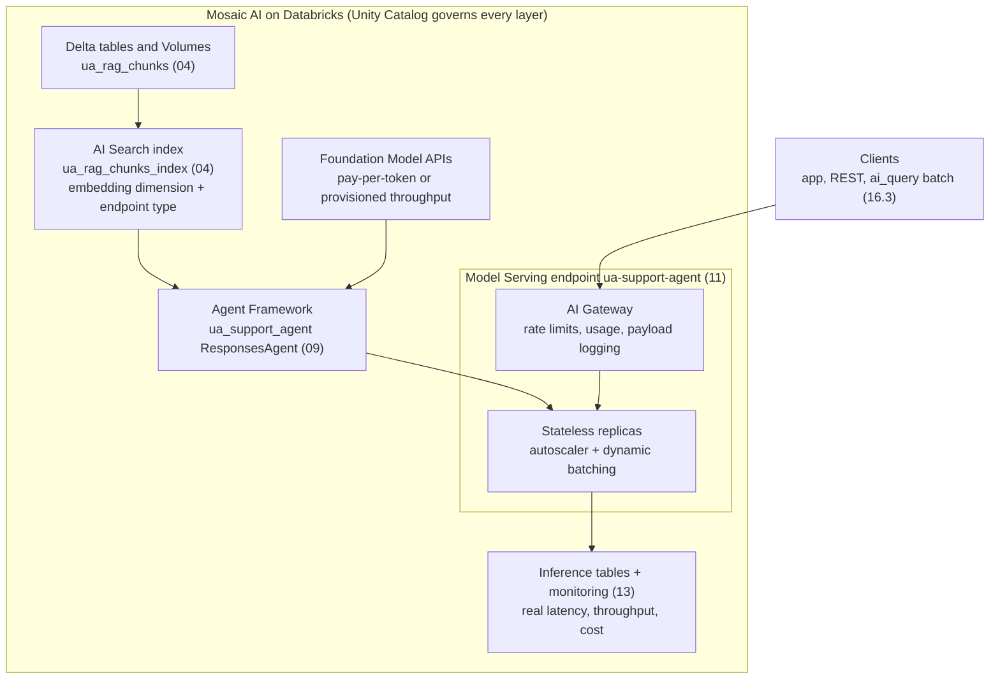
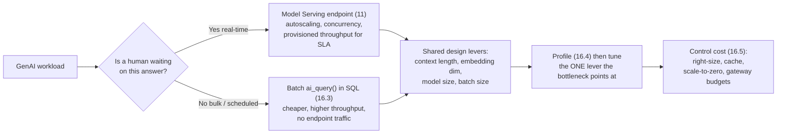

# Cost, performance and scaling  ·  Module 16  ·  Topics 16.1–16.6  ·  [Theory + Hands-on]

> **You are here:** Roadmap **Level 7 · Module 16 — Cost, performance and scaling** (topics 16.1–16.6). Every other module is already built. This module puts the **architect and operator lens** on the whole Unity Airways stack: how Mosaic AI serves GenAI at scale, which knobs move latency, throughput, and cost, and how to keep a working system from getting slow or expensive as traffic grows.
> **Prerequisites:** **Module 11** (Model Serving, AI Gateway, batch `ai_query`), **Module 04** (the AI Search index `unity_airways.rag.ua_rag_chunks_index`), **Module 08** (evaluation — the quality gate you never trade away for speed), **Module 13** (monitoring + inference tables — where you read real latency/cost). Next stop: **Module 17 — Reference architectures**.

This page is the **module hub**. It carries one numbered entry per topic (16.1–16.6). One topic is a **cornerstone (★)** with its own deep-dive page:

- **16.1 ★ — Mosaic AI architecture; model serving at scale** → `mosaic-ai-architecture.md` / `mosaic-ai-architecture.html`

Everything here reuses the **Unity Airways** stack you already built: the RAG chunks and AI Search index (04), the `ua_support_agent` `ResponsesAgent` (09), the deployed serving endpoint **`ua-support-agent`** (11), inference tables + monitoring (13), and Foundation Model APIs like `databricks-claude-sonnet-4-5` and embeddings `databricks-gte-large-en`. `CATALOG="unity_airways"`, `SCHEMA="rag"`.

> 📌 **The one idea that shapes this module — cost, latency, and quality are one three-way trade-off, and you tune it with a few named levers, not by "buying a bigger box."** The levers are: **context length**, **embedding dimensionality**, **batch size / concurrency**, **endpoint sizing** (scale-to-zero vs provisioned throughput), and **batch vs real-time execution**. You profile first, find the actual bottleneck, then move the one lever that fixes it.

---

## TL;DR
- **Mosaic AI serves GenAI at scale (16.1 ★)** with **horizontally scalable, stateless endpoints** and an **autoscaler that watches throughput** and adds replicas under load. GPU-backed endpoints plus **dynamic batching** give the best throughput for heavy inference. Model Serving, AI Gateway, AI Search, Agent Framework, and Unity Catalog governance are the pieces of the architecture.
- **Context length and embedding dimension (16.2)** are the two design-time levers that set answer quality against latency, storage, and cost. Bigger is not automatically better. Start moderate, raise only when profiling proves you need to.
- **Batch inference with `ai_query()` (16.3)** is the right engine when **no human is waiting** — large tables, seconds-to-minutes latency, scheduled runs. It offloads inference to SQL compute, so you skip endpoint traffic entirely. It is the same surface you already used in **11.10**.
- **Performance testing and profiling (16.4)** means simulating realistic query traffic, then breaking end-to-end time into vector-search time, model-execution time, queue-wait, and orchestration overhead. You fix the bottleneck the profile points at, not the one you guessed.
- **Controlling cost (16.5)** on Databricks: prefer **smaller/task-right models**, **cache and batch** repeated work, run bulk jobs as **batch `ai_query`** instead of real-time, use **scale-to-zero** for spiky dev traffic and **provisioned throughput** for steady production, and meter/limit spend with **AI Gateway usage tracking, rate limits, and budgets** on Foundation-Model / external endpoints.
- **Fine-tuning and provisioned throughput (16.6, beyond the exam)** live in **Mosaic AI Model Training**. Provisioned throughput is the dedicated-capacity serving mode for custom or fine-tuned weights and for production latency guarantees.

## The problem
- The Unity Airways agent works. It is evaluated (08), deployed (11), governed (12), and monitored (13). Then real traffic arrives.
- Support volume triples during a weather event. The chat endpoint gets slow, the nightly ticket-scoring job runs for hours, and finance asks why the Foundation Model bill doubled in a week.
- Someone proposes "just make the endpoint bigger." It costs more and the latency barely moves, because the real bottleneck was a 32k-token context window stuffing 15 retrieved chunks into every prompt.
- This is the module where a working demo becomes a **system that stays fast and affordable under load** — and where an FDE answers the two questions every customer eventually asks: *"How do we make it faster?"* and *"How do we keep the cost sane?"*

## Why the naive approach fails
- **"Scale the endpoint until it's fast."** Adding replicas or a bigger workload size fixes a concurrency bottleneck, but does nothing for a long-context or slow-retrieval bottleneck. You pay more and stay slow. Profile first (16.4).
- **"Use the biggest model and the longest context for everything."** Bigger models and longer contexts raise latency and per-token cost on *every* request, including the simple ones. Most production traffic is better served by smaller, task-right models (16.2, 16.5).
- **"Loop the real-time endpoint row-by-row for the nightly batch."** Slow, expensive, and fragile — you re-own batching, retries, and checkpointing. Bulk work belongs in a single `ai_query()` over a table (16.3).
- **"Raise the embedding dimension for better retrieval — it's a config flag."** Higher dimensions can improve recall, but they cost storage and slow similarity search, and **changing the dimension means re-embedding the whole corpus and rebuilding the index** (16.2).
- **"Turn on AI Gateway rate limits on the agent endpoint to cap cost."** On an **agent** serving endpoint, AI Gateway supports **inference tables only** — guardrails, rate limits, and usage tracking need a **Foundation-Model or external-model endpoint** (16.5). Getting this wrong is a common field mistake.

## What it is
- **Plain-language definition:** *Cost, performance and scaling* is the practice of choosing and tuning the levers — model size, context length, embedding dimension, batch size, concurrency, endpoint sizing, and batch-vs-real-time execution — so a GenAI system meets its latency and quality targets at an acceptable cost as load grows.
- **Mental model:** the architecture (16.1) is the machine; 16.2–16.6 are the control panel. You read the gauges (profiling + monitoring), then move one lever at a time.
- **Where it sits:** this is the operate-and-optimize layer on top of everything else. It does not replace serving (11), retrieval (04), or evaluation (08) — it decides how big, how fast, how batched, and how much they cost.

## Why it matters (for a Databricks FDE)
- **This is the "make it faster and cheaper" conversation.** Once a POC is in production, the questions stop being "does it work" and become "does it scale" and "what does it cost." Module 16 is your toolkit for both.
- **One tuning story across the platform.** The same levers — context length, embedding dimension, batching, concurrency, provisioned throughput, batch `ai_query` — apply to hand-coded agents (09), Agent Bricks tiles (10), Foundation Models, and SQL enrichment jobs. You teach one optimization model.
- **It is squarely on the exam.** Batch `ai_query` suitability, embedding-dimension and context-length trade-offs, Model Serving endpoint optimization, and Databricks cost-control features are called out in the blueprint (Assembling and Deploying = 22%, plus Design and Data-Prep threads). 16.6 (fine-tuning / Model Training) is flagged **beyond the exam blueprint**.

## Core concepts
- **Mosaic AI serving at scale** — stateless, horizontally scalable endpoints; an autoscaler that watches throughput; GPU + dynamic batching for heavy inference. See 16.1 ★.
- **Context length** — the max tokens a model processes per request; caps how many retrieved chunks (and how much history) fit. Longer = more complete answers but higher latency and token cost. See 16.2.
- **Embedding dimensionality** — the number of values per embedding vector; more dimensions capture more semantic nuance but cost storage and slow similarity search. See 16.2.
- **Batch size / dynamic batching** — how many requests the engine groups into one forward pass; larger batches improve GPU efficiency but add queue-wait latency. Tuned with max batch size, queue timeout, and concurrency limit. See 16.4.
- **Batch inference (`ai_query`)** — SQL-native, one-model-call-per-row inference on a table, run on SQL compute; the right tool when latency in seconds-to-minutes is fine. See 16.3.
- **Profiling** — splitting end-to-end latency into vector-search, model-execution, queue-wait, and orchestration time so you fix the true bottleneck. See 16.4.
- **Endpoint sizing** — `scale_to_zero` (cheap idle, cold-start cost) vs **provisioned throughput** (reserved tokens/second, guaranteed latency). See 16.5, 16.6.
- **Cost levers** — token-based vs compute-based pricing, model-size choice, caching + batching, batch vs real-time, AI Gateway usage tracking / rate limits / budgets. See 16.5.

## 🗺️ Visual map

**The Mosaic AI architecture behind the Unity Airways stack — every layer is governed by Unity Catalog, and each is a place where cost and performance are decided:**

*Takeaway: retrieval, the agent, the served model, and the gateway are separate scalable pieces. Cost and latency get decided at each one — embedding dimension at the index, context length at the prompt, concurrency and provisioned throughput at the endpoint, and batch-vs-real-time at the client.*

**The first decision for any GenAI workload — is a human waiting? — and the levers that follow:**

*Takeaway: the "human waiting?" question routes the workload to real-time serving or batch `ai_query`. After that, both share the same tuning levers, and both get cheaper with the same cost discipline.*

---

## 16.1 ★ Mosaic AI architecture overview; model serving at scale  ·  [Theory]

> **Cornerstone.** Full deep-dive — the architecture map (serving, AI Gateway, AI Search, Agent Framework, governance) and how a single endpoint scales (stateless replicas, autoscaling, concurrency, dynamic batching, routing, provisioned throughput) — lives in `mosaic-ai-architecture.md` / `mosaic-ai-architecture.html`. Summary here.

- **Mosaic AI is the umbrella** for Databricks' GenAI stack: **Model Serving** (three endpoint families — custom / Foundation Model / external), **AI Gateway** (the governed edge), **AI Search** (retrieval), the **Agent Framework** (`ResponsesAgent`), and **Unity Catalog** governing all of it.
- **Serving at scale = stateless + autoscaling.** Each endpoint is horizontally scalable and stateless, so any request can hit any replica with no session state. The autoscaler watches throughput and adds/removes replicas; because retriever and model-serving scale independently, the system stays responsive when volume surges.
- **GPU + dynamic batching wins for heavy inference.** Pairing GPU-backed endpoints with request batching gives the best throughput for large enterprise RAG. The agent endpoint itself is usually CPU orchestration; the GPU-heavy LLM work sits on a separate Foundation Model endpoint it calls.
- **Provisioned throughput** is the production serving mode when you need reserved capacity and latency guarantees, or you serve custom / fine-tuned weights (see 16.6).
- **Key APIs/names:** Mosaic AI, Model Serving, AI Gateway, AI Search, Agent Framework / `ResponsesAgent`, Foundation Model APIs, provisioned throughput, autoscaling, dynamic batching.

## 16.2 Context length and embedding-dimension trade-offs  ·  [Theory]

- **Context length** = the max tokens a model accepts per request. It caps how many retrieved chunks and how much conversation history fit in one prompt. A ~4k-token model might fit two retrieved documents; a 16k–32k model fits several longer ones and gives more complete answers — at higher latency and token cost. If prompt + system message + retrieved context exceed the window, the input is **truncated**, which causes hallucinations or off-topic answers.
- **Embedding dimensionality** = the number of values per embedding vector. A 384-dim embedding captures basic similarity; a 1024-dim (or 768–1536+) embedding distinguishes subtler meanings (`forecasting revenue` vs `forecasting weather`). Higher dimensions improve retrieval precision but cost more storage and slow similarity search.
- **Both are a cost/latency/quality trade-off** (see Table 9-8 framing): short context = lower latency and cost but risks truncation; large embeddings = better recall but slower, pricier search. **Start moderate and raise only when profiling shows a real bottleneck or accuracy gap.**
- **Model size is the sibling lever:** small (<7B) models are cheaper and faster and fine for classification/intent; mid (7B–13B) balance cost and quality; large (13B+) reason better but cost more and add latency. Match model size to the task, not to hope.
- **Key APIs/names:** context length / context window, token limit, embedding dimensionality, `databricks-gte-large-en`, truncation, model cards / metadata (context window is a documented attribute).

> ⚠️ **GOTCHA:** context length and embedding dimension must be checked **together** in a RAG chain — the embedding model's max input and the LLM's context window both bound how big a chunk you can use. And **changing embedding dimension requires regenerating every embedding and rebuilding the index**; it is not a live config flip.

## 16.3 Batch inference workloads suitable for `ai_query()`  ·  [Theory + Hands-on]

- **What it is:** `ai_query('<endpoint or FM>', <request>)` runs a served model over a table, **one model call per row**, on SQL compute. The SQL engine handles parallelism, distribution, and retries. You already used this in **11.10** — 16.3 is the "when is it the *right* engine" lens.
- **A workload suits `ai_query()` when three things are true:** (1) it runs on **large datasets / batches** (thousands to millions of rows); (2) it does **not need synchronous interaction** — a nightly or hourly job is fine and nobody waits milliseconds; (3) it follows a **consistent schema** expressible in SQL. Typical fits: embedding generation, scheduled content enrichment, periodic RAG-quality evaluation.
- **When NOT to use it:** user-facing, real-time, low-latency flows — chatbots, live support agents, interactive dashboards. Those need Model Serving (11) with autoscaling and concurrency. `ai_query()` has **no conversational state, tool-calling, or multi-step agent workflow** — for those, call your deployed *agent* endpoint (`ua-support-agent`) from inside `ai_query`.
- **Why it saves money:** it offloads inference to SQL compute and skips endpoint traffic, improving throughput and simplifying orchestration for ETL-style refreshes. Always set `failOnError => false` on scheduled runs and filter `WHERE ... IS NOT NULL` to skip wasted calls.
- **Unity Airways example:** the nightly job that scores every new support ticket for intent/sentiment/summary, and the embedding refresh over `ua_rag_chunks`, both belong in `ai_query()`. See the module lab.
- **Key APIs/names:** `ai_query`, `responseFormat`, `failOnError`, SQL warehouse / DBSQL job, batch inference.

## 16.4 Performance testing and profiling; high-throughput retrieval  ·  [Hands-on]

- **Test with realistic traffic.** Replay production logs or generate synthetic load (thousands of retrieval queries per minute) to see whether the AI Search index responds under load and whether serving endpoints scale as traffic climbs.
- **Profile to split the time up.** Break end-to-end latency into **vector-search time**, **model-execution time**, **queue-wait time** (batching), and **orchestration overhead**, plus GPU/CPU efficiency. The picture is: incoming requests → load generator → vector-search and serving-endpoint profiling → latency + throughput metrics → a performance dashboard.
- **Know the bottleneck types** so a symptom points at a cause: slow similarity search or **index saturation** (too many concurrent queries), **low embedding fidelity**, **model-execution slowdown** (context too long), **inefficient batching**, **autoscaler delay**, **slow orchestration/routing**, **context truncation**, and **end-to-end** (many small delays add up).
- **Symptom → fix (Table 9-11 framing):** high end-to-end latency → reduce context size / tune AI Search params; low GPU utilization → raise the concurrency limit; excessive queue wait → lower the batch timeout; retrieval lacks relevance → raise embedding dimension; index slow under load → rebuild/repartition the index or adjust hardware.
- **High-throughput retrieval:** AI Search endpoints come in **Standard** and **Storage-optimized** (for very large vector counts and faster indexing); **hybrid search** (keyword + vector) trades a little latency for recall. Scale the index independently of the LLM.
- **Golden rule:** **always profile individual components before scaling infrastructure.** Adding compute without knowing the root cause raises cost without improving performance.
- **Key APIs/names:** load testing / traffic replay, profiling, latency / throughput / queue-wait / GPU utilization, AI Search Standard vs Storage-optimized endpoints, hybrid search, inference tables (13) as the real-traffic profile.

## 16.5 Controlling LLM / GenAI costs with Databricks features  ·  [Theory]

- **Understand the pricing shape first.** Foundation Models bill **per token** (input + output), so cost scales with prompt length, retrieved context, and response length. Provisioned throughput and custom-model endpoints bill on **compute time**. Long contexts and big models cost on *every* call.
- **Right-size the model and context (16.2).** Route high-volume, low-risk tasks (ticket tagging, intent) to small/fast models; reserve large models for complex reasoning. You can dynamically switch model by query complexity.
- **Cache and batch repeated work.** Cache answers to frequently repeated queries and batch scheduled tasks to cut inference cost. Batch **`ai_query()` (16.3)** is materially cheaper than looping a real-time endpoint for bulk jobs.
- **Right-size the endpoint.** Use **`scale_to_zero`** for spiky dev traffic (cheap idle, cold-start cost) and **provisioned throughput** for steady production where predictable cost and latency matter (16.6).
- **Meter and cap spend with AI Gateway** — but on the correct endpoint type. On a **Foundation-Model or external-model** endpoint, AI Gateway gives **usage tracking** (system tables), **rate limits**, provider **fallbacks**, and **budgets / cost caps** (Unity AI Gateway, Beta). Use system tables + inference tables (13) to attribute spend.
- **Key APIs/names:** token-based vs compute-based pricing, model right-sizing, caching, batching, `scale_to_zero`, provisioned throughput, AI Gateway usage tracking / rate limits / budgets.

> ⚠️ **GOTCHA (carry from Module 11/12):** AI Gateway on an **agent** serving endpoint (like `ua-support-agent`) supports **inference tables only**. Rate limits, guardrails, and usage tracking require a **Foundation-Model or external-model endpoint**. To cap spend on the agent, put budgets/limits on the **Foundation Model endpoint the agent calls**, not on the agent endpoint itself.

## 16.6 Fine-tuning and provisioned throughput (Mosaic AI Model Training) — beyond the exam  ·  [Theory]

> **Beyond the exam blueprint.** This topic is architect-context, not a certification objective. Learn it to answer "should we fine-tune?" and "how do we get guaranteed serving capacity?" — not because it is tested.

- **Provisioned throughput** is the Foundation Model APIs serving mode that **reserves a tokens-per-second band** with guaranteed latency/throughput. It is **recommended for production workloads**, is required to serve **custom or fine-tuned weights**, and is available with compliance certifications (for example HIPAA). Contrast with **pay-per-token**, which is zero-setup and best for prototyping and bursty load.
- **Fine-tuning is now part of Mosaic AI Model Training.** The older standalone "Fine-tuning" surface is deprecated; the current framing is **fine-tuning as a capability of Databricks Model Training** that customizes a base model on your data (the trained weights are then served via provisioned throughput).
- **When fine-tuning earns its cost:** a stable, narrow task where prompt engineering + RAG have plateaued, you have quality labeled data, and you need lower latency or per-token cost than a large general model. For most Unity Airways needs, **RAG + a good base model + right-sizing** is cheaper and faster to ship than a fine-tune.
- **Cost trade-off:** fine-tuning adds a training cost and an ongoing provisioned-throughput serving cost. It pays off only when volume is high enough that a smaller fine-tuned model beats a large general model on total cost at the required quality.
- **Key APIs/names:** provisioned throughput, Mosaic AI Model Training, fine-tuning, custom weights, pay-per-token (contrast).

---

## Worked example (Unity Airways, a scaling incident, end to end)

A weather event triples Unity Airways support traffic. The chat agent slows to ~8s and the Foundation Model bill spikes. Here is the Module-16 playbook:

1. **Profile, don't guess (16.4).** Read the inference table (13) and a quick load test. The profile shows model-execution time dominates — each prompt carries 15 retrieved chunks in a 32k context. Vector search and queue-wait are fine.
2. **Cut the context lever (16.2).** Drop retrieval from 15 chunks to the top 5, and cap the context. Evaluation (08) confirms answer quality holds. Latency falls and per-call token cost drops on every request.
3. **Right-size the endpoint (16.1 / 16.5).** Turn **off** `scale_to_zero` on the customer path so cold starts stop reading as "slow," and raise the concurrency band to match observed peak. Keep GPU + dynamic batching on the Foundation Model endpoint.
4. **Move bulk work off the hot path (16.3).** The overnight ticket-scoring and the embedding refresh were competing with live traffic through the endpoint. Convert them to **batch `ai_query()`** on a SQL warehouse, scheduled by a Lakeflow Job — cheaper and off the real-time endpoint entirely.
5. **Cap the spend (16.5).** Put **rate limits and a budget** on the **Foundation Model endpoint** the agent calls (not the agent endpoint — that only supports inference tables). Usage system tables now show spend per app.
6. **Consider provisioned throughput (16.6).** Traffic is now steady and high, so switch the Foundation Model endpoint to **provisioned throughput** for predictable latency and cost. Fine-tuning is discussed and deferred — RAG + right-sized model already meets the SLA.

**How to verify it worked:** p95 latency back under target on the live endpoint; the batch job runs on SQL compute without touching the real-time endpoint; the Foundation Model endpoint shows a rate limit and budget; and the eval score from Module 08 is unchanged, proving speed and cost came without a quality regression.

---

## Uses, edge cases and limitations

| Situation | Watch out for | Better move |
|---|---|---|
| Endpoint is slow | You scale replicas blindly | **Profile first** (16.4), then move the lever the bottleneck points at |
| Answers feel thin | You max out context "to be safe" | Right-size context + top-k; profile latency vs quality (16.2) |
| Retrieval misses relevant docs | You leave embeddings tiny | Raise embedding dimension, then **re-embed + rebuild the index** (16.2) |
| Score millions of rows | You loop the real-time endpoint | Batch **`ai_query()`** on SQL compute (16.3) |
| Bill is climbing | You reach for a bigger model | Right-size model, cache, batch, scale-to-zero, gateway budgets (16.5) |
| Need to cap agent spend | You add limits on the agent endpoint | Limits/budgets on the **Foundation Model endpoint** it calls (16.5) |
| Steady high production load | You stay on pay-per-token | **Provisioned throughput** for predictable latency + cost (16.6) |
| Prompt + RAG have plateaued | You fine-tune too early | Fine-tune only when volume justifies it (Model Training, 16.6) |

## Common mistakes / gotchas
- Scaling infrastructure before profiling — pays more, stays slow. The bottleneck is often context length or retrieval, not replica count.
- Using the biggest model and longest context for every request, including trivial ones. Route by task and query complexity.
- Treating embedding dimension as a live flag — changing it forces a full re-embed and index rebuild.
- Looping a real-time endpoint for batch work instead of `ai_query()` (16.3).
- Putting rate limits/guardrails on an **agent** endpoint — those need a Foundation-Model / external-model endpoint; the agent endpoint only supports inference tables.
- Leaving `scale_to_zero` on for a latency-critical customer path (cold starts read as "the model is slow").
- Fine-tuning before RAG + right-sizing have been exhausted; usually more cost for little gain.
- Calling it "Mosaic AI Vector Search" or forgetting the SDK is still `databricks-vectorsearch` despite the **AI Search** rename.

## > 📌 IMPORTANT callouts
- **Cost, latency, and quality are one trade-off.** Every lever (context, embedding dim, model size, batch/concurrency, endpoint sizing, batch-vs-real-time) moves at least two of the three. Decide which one you are optimizing for the workload.
- **Profile before you scale.** Split end-to-end latency into vector-search, model-execution, queue-wait, and orchestration, then move the lever that matches the real bottleneck.
- **"Is a human waiting?" routes the workload.** Yes → Model Serving (autoscaling, provisioned throughput). No → batch `ai_query()`. This single question is the biggest cost/perf decision you make.

## > 💡 TIP
- Read real latency and token cost from the **inference table (13)**, not from a stopwatch on one request. Right-size `workload_size` and top-k from that data.
- Develop batch jobs on a `LIMIT` sample first to confirm shape and cost, then remove the limit.
- Keep the **Foundation Model endpoint name stable** so you can move budgets, limits, and provisioned throughput without touching agent code.

## > ⚠️ GOTCHA
- **AI Gateway on the agent endpoint = inference tables only** (rate limits/guardrails/usage need an FM or external endpoint). Live re-check the exact per-feature support before a customer commitment.
- **Provisioned throughput** availability, regions, and compliance certs change — confirm on the Foundation Model APIs docs at authoring time (live re-check pending).
- **Fine-tuning is now Model Training** — the old standalone fine-tuning page is deprecated; teach the Model Training framing (16.6 is beyond the exam).
- **Served-model names churn** (e.g. `databricks-claude-sonnet-4-5`); confirm on the supported-models page. DBRX is treated as retired.

## 📝 Notes
- _Space for your own notes as you work through the module._

**Self-check (5 questions)**
1. Your agent endpoint is slow under load. Before adding replicas, what do you do, and what four time components do you split end-to-end latency into?
2. Give one advantage and one disadvantage each of (a) a long context window and (b) large embedding dimensions. Why is changing the embedding dimension expensive?
3. State the three characteristics that make a workload suitable for batch `ai_query()`, and name two workloads that are **not** suitable.
4. List four Databricks features or tactics for controlling GenAI cost. Which endpoint type must AI Gateway rate limits sit on, and why not the agent endpoint?
5. What is provisioned throughput, when do you choose it over pay-per-token, and which Mosaic AI product now owns fine-tuning?

## How this maps to the certification
- **Assembling and Deploying Applications (22%)**: "distinguish interactive serving from batch inference," "identify batch inference workloads and apply `ai_query()` appropriately," Model Serving endpoint optimization for scalability, and serving LLM applications with Foundation Model APIs — all core to 16.1, 16.3, 16.5.
- **Design Applications (14%) / Data Preparation (14%)** threads: "select an embedding model context length based on source documents, expected queries, and optimization strategy," and evaluating cost/latency/quality trade-offs — 16.2, 16.5.
- 16.6 (fine-tuning / Model Training) is **beyond the exam blueprint** — architect context only.

## Sources
- 📗 **B2 — *Databricks Certified GenAI Engineer Associate Study Guide*** — **Ch 9 "Scaling and Optimizing GenAI/RAG Systems"** (primary): Mosaic AI serving is horizontally scalable, stateless, autoscaled on throughput; GPU + dynamic batching for high throughput; **Optimization and Infrastructure** — embedding dimensionality (384 vs 1024), context length (4k vs 16k), batch size (Table 9-8, Table 9-9 batch params: max batch size / queue timeout / concurrency limit); **Performance Testing and Profiling** (Fig 9-12 components; Table 9-10 bottleneck types; Table 9-11 issue→cause→adjustment); **Batch Inference with `ai_query()`** (Table 9-12 suitability; Example 9-7 batch embedding; no conversational state/tools/multi-step). **Ch 2** — "Selecting Embedding Model Context Lengths and LLM Sizes," "Balancing Cost, Latency, and Quality When Choosing Models" (token-based vs compute-based pricing; Table 2-6 model sizes; Table 2-7 model metadata; TIP: caching + batching to reduce cost). **Ch 5** — interactive serving vs batch inference, endpoint optimization. *(O'Reilly Early Release — RAW & UNEDITED; verify against docs.)*
- 🧭 **naming-conventions.md** §4 (three Model Serving families; Foundation Model APIs pay-per-token vs **provisioned throughput**; served-model names churn), §3 (AI Search Standard vs **Storage-optimized** endpoints; hybrid search; SDK still `databricks-vectorsearch`), §6 (**AI Gateway** rate limits / usage tracking / **Unity AI Gateway** budgets). Verified July 2026.
- 🌐 **Databricks Docs** (bounded live-check, July 2026): Foundation Model APIs — **provisioned throughput** "recommended for all production workloads," available with compliance certs `docs.databricks.com/aws/en/machine-learning/foundation-model-apis/`; **"Fine-tuning (now part of Databricks Model Training)"** — old fine-tuning page deprecated `docs.databricks.com/aws/en/large-language-models/foundation-model-training/`. Cross-module: Model Serving `.../machine-learning/model-serving/`; AI Functions / `ai_query` `.../large-language-models/ai-functions`; AI Gateway `.../ai-gateway/`.
- 📎 **Built modules cross-referenced (not re-taught):** 04 (AI Search index), 09 (`ua_support_agent`), 11 (Model Serving, AI Gateway, batch `ai_query` — 11.10), 12 (guardrails), 13 (monitoring + inference tables).

---

### Next module → **Module 17 — Reference architectures and unifying GenAI systems**
Module 17 zooms all the way out: the 5-phase GenAI lifecycle as an architecture, MLflow Traces and OpenTelemetry as the shared integration fabric, the MLflow Agent Server as a stable serving layer, MCP as the bridge to assistants and IDEs, third-party judges, and the end-to-end enterprise reference architecture (Capstone C4). Module 16 made the system fast and affordable; Module 17 makes all the pieces one coherent platform.

**Want to go hands-on?** The **Module 16 lab notebook** (`notebooks/16-cost-performance-scaling/16-module-lab.py`) runs the optimization playbook end to end on the Unity Airways data: a batch `ai_query()` pass over a Delta table, a high-throughput AI Search retrieval pass, simple latency/throughput profiling with timing cells, and a cost-lens comparison of endpoint types and batch-vs-real-time.
