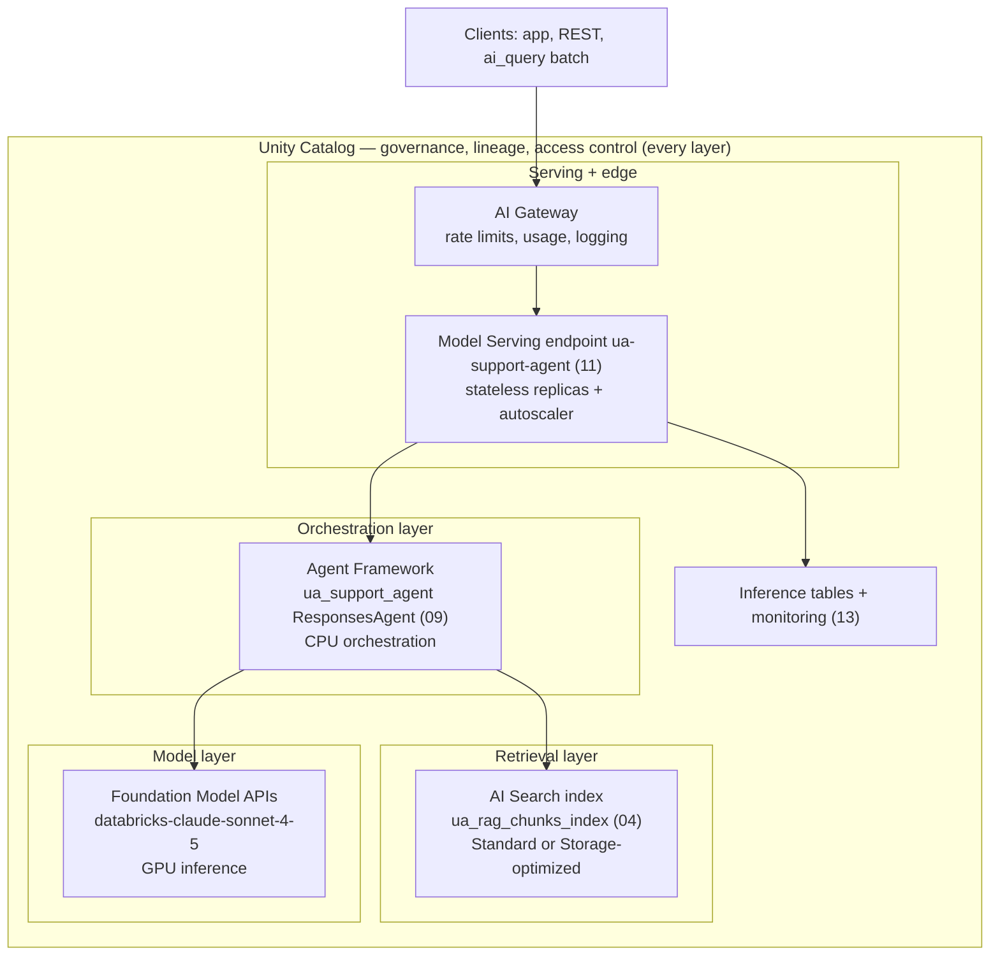
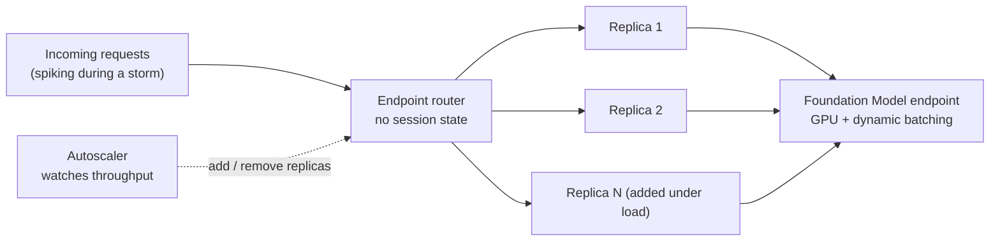

# Mosaic AI architecture; model serving at scale  ·  Module 16 · Topic 16.1 ★  ·  [Theory]

> **You are here:** Roadmap **Level 7 · Module 16 → 16.1** (cornerstone deep-dive). Prereqs: **Module 11** (Model Serving, AI Gateway), **Module 04** (AI Search), **Module 09** (the `ua_support_agent`). This page is the architecture map for the whole module — 16.2–16.6 tune the levers inside it.

## TL;DR
- **Mosaic AI** is the umbrella name for Databricks' GenAI stack. The load-bearing pieces are **Model Serving**, **AI Gateway**, **AI Search**, the **Agent Framework**, and **Unity Catalog** governing all of it.
- The architecture is **layered and independently scalable**: retrieval scales separately from the agent, which scales separately from the served LLM. One slow layer does not force you to overpay for the others.
- **Serving at scale means stateless, horizontally scalable endpoints** behind an **autoscaler** that watches throughput and adds or removes replicas. No session state, so any request can hit any replica.
- **GPU + dynamic batching** gives the best throughput for heavy inference; **provisioned throughput** reserves capacity when you need guaranteed latency or serve custom/fine-tuned weights.
- The Unity Airways agent endpoint is **CPU orchestration** that calls a **separate Foundation Model endpoint** for the GPU-heavy LLM work — this split is the single most important architecture fact for cost and scaling.

## The problem
- You can draw the Unity Airways pipeline on a whiteboard — retrieve, prompt, generate, log. But "how does this stay up and stay fast when 10,000 passengers hit it during a storm?" is a different question.
- If you think of the deployed agent as "one box that runs the model," every scaling and cost decision is wrong: you scale the wrong thing, you pay for GPUs on an orchestration layer, and you cannot explain where latency or spend actually comes from.
- The fix is to see Mosaic AI as it really is — **a set of separately governed, separately scalable services** — so you can point at the exact layer a bottleneck lives in and move exactly one lever.

## Why the naive approach fails
- **"The agent endpoint runs the LLM, so give it big GPUs."** Wrong. The agent endpoint orchestrates (CPU); the LLM inference happens on a **Foundation Model endpoint** it calls. GPU spend belongs there, sized by real token throughput.
- **"One endpoint, one replica, scale vertically."** GenAI serving scales **horizontally** — more stateless replicas, not a bigger single machine. Vertical-only thinking hits a ceiling and wastes money.
- **"Retrieval and generation are one thing, so scale them together."** They are separate services. During a spike you may need more AI Search capacity and the same LLM capacity, or vice versa. Coupling them overprovisions one to fix the other.
- **"Autoscaling means I never think about capacity."** The autoscaler reacts to throughput, so there is an **autoscaler-delay** window during a sudden spike, and a **cold-start** cost if `scale_to_zero` is on. Production latency-critical paths keep a warm replica or use provisioned throughput.

## What it is
- **Plain-language definition:** *Mosaic AI* is Databricks' end-to-end GenAI platform — the managed services for retrieval, agent authoring, model serving, edge governance, and observability, all sitting on Unity Catalog. *Serving at scale* is how Model Serving keeps an endpoint fast under load: stateless replicas, an autoscaler, request routing, and (optionally) dynamic batching and provisioned throughput.
- **Mental model:** a **layered factory**. Unity Catalog is the floor and the rulebook (governance). AI Search is the parts warehouse (retrieval). The Agent Framework is the assembly line (orchestration). Foundation Model APIs are the heavy machinery (LLM inference). Model Serving is the loading dock every client uses, and AI Gateway is the gatehouse metering what goes in and out.
- **Where it sits:** this is the substrate under Modules 04–15. 16.1 names the parts; the rest of Module 16 tunes them.

## Why it matters (for a Databricks FDE)
- **You cannot size or price a system you cannot decompose.** Customers ask "how many GPUs?" and "what will it cost at 1M requests/day?" — you answer by pointing at the layer that actually does the work.
- **The CPU-agent / GPU-model split is the money conversation.** Explaining that the agent orchestrates on CPU and the LLM runs on a separately-scaled endpoint reframes the whole cost model.
- **It de-risks the scale story.** "Retrieval and serving scale independently, statelessly, with autoscaling" is exactly what a platform team needs to hear before they trust the system with production traffic.

## Core concepts
- **Mosaic AI** — the GenAI platform umbrella (Model Serving, AI Gateway, AI Search, Agent Framework, Foundation Model APIs), governed by Unity Catalog.
- **Model Serving** — the managed endpoint service; three families: **custom models**, **Foundation Models**, **external models**. All GA.
- **Stateless, horizontally scalable endpoint** — replicas hold no session state, so requests route to any replica and the system scales out, not up.
- **Autoscaler** — watches throughput and adjusts replica count; introduces a reaction window (autoscaler delay) and, with `scale_to_zero`, cold starts.
- **Dynamic batching** — groups incoming requests into one forward pass to raise GPU efficiency; tuned by max batch size, queue timeout, concurrency limit.
- **Provisioned throughput** — reserved tokens/second with guaranteed latency; required for custom/fine-tuned weights; the production mode.
- **AI Gateway** — the governed edge on a serving endpoint: rate limits, usage tracking, payload logging, fallbacks (on Foundation-Model / external endpoints).
- **Routing / traffic split** — one endpoint can hold multiple served entities and split traffic (the basis for canary rollout, Module 11.6/11.8).

## 🗺️ Visual map

**The Mosaic AI architecture — five layers, all governed by Unity Catalog, each independently scalable:**



*Takeaway: a request enters through the gateway to the serving endpoint, which runs the agent (CPU); the agent calls AI Search for context and the Foundation Model endpoint for generation. Each layer scales on its own, and Unity Catalog governs all of them.*

**How a single endpoint scales — stateless replicas behind an autoscaler:**



*Takeaway: because replicas are stateless, the router spreads load across as many as the autoscaler provisions. The agent replicas are CPU; the GPU-heavy generation is pooled on a separate Foundation Model endpoint with dynamic batching.*

---

## How it works — deep dive

### The five layers (and where cost/latency live)
- **Governance (Unity Catalog):** permissions, lineage, and audit across models, functions, indexes, and data. Not a performance layer, but it decides *who* can call *what* — and it is where usage system tables land.
- **Retrieval (AI Search):** turns a query into an embedding and returns top-k chunks. Cost/latency levers here: **embedding dimension**, **endpoint type** (Standard vs Storage-optimized), **hybrid search**, and index partitioning (16.2, 16.4).
- **Orchestration (Agent Framework):** the `ResponsesAgent` that assembles the prompt, calls tools, and calls the LLM. Runs on **CPU**. Lever: how much context it stuffs into each prompt (16.2).
- **Model (Foundation Model APIs):** the actual LLM inference, on **GPU**. Levers: model size, pay-per-token vs provisioned throughput, dynamic batching (16.5, 16.6).
- **Serving + edge (Model Serving + AI Gateway):** the endpoint that hosts the agent, its replicas and autoscaler, and the gateway that meters traffic. Levers: `workload_size`, `scale_to_zero`, concurrency, rate limits/budgets (16.5).

### Serving at scale — the mechanism
- **Stateless + horizontal.** Every replica is interchangeable; the router sends each request to any free replica. Adding capacity = adding replicas, not enlarging one machine.
- **Autoscaling on throughput.** The autoscaler monitors request throughput and scales the replica pool up under load and down when idle. This keeps the system responsive during surges but reacts with a short delay — the **autoscaler-delay** bottleneck (16.4).
- **Cold start vs warm.** With `scale_to_zero`, an idle endpoint drops to zero replicas (cheap) but the next request pays a cold start. Latency-critical production paths turn it off or use provisioned throughput.
- **Dynamic batching on the model layer.** The Foundation Model endpoint groups concurrent requests into batches for GPU efficiency; larger batches raise throughput but add queue-wait. Tuned by max batch size / queue timeout / concurrency limit (16.4).
- **Independent scaling.** Because retriever and model endpoints scale separately, a retrieval-bound spike and a generation-bound spike get different fixes.

### Endpoint families and serving modes
- **Custom models** — your MLflow-packaged logic (the `ua_support_agent`). CPU for orchestration.
- **Foundation Models** — Databricks-hosted LLMs via Foundation Model APIs. Two modes: **pay-per-token** (zero setup, bursty/low volume) and **provisioned throughput** (reserved capacity, SLA latency, required for custom/fine-tuned weights — see 16.6).
- **External models** — a governed proxy to OpenAI/Anthropic/Google; centralizes keys, spend, and rate limits (pairs with AI Gateway).
- **Routing / traffic split** — one endpoint can serve multiple versions and split traffic for canary rollout (Module 11.6/11.8).

## How to do it on Databricks
- **See the architecture in the workspace:** Serving page (the endpoint, its state, workload size, traffic), Catalog (the model, index, and functions under Unity Catalog), and the inference table + monitoring dashboard (13) for real latency/throughput.
- **Sizing knobs on a served entity:** `workload_size` (concurrency band), `workload_type` (CPU for agents, GPU for in-process heavy inference), `scale_to_zero_enabled`.
- **Read capacity from data, not guesswork:** size `workload_size` and decide on provisioned throughput from the inference table's observed peak throughput and latency, not from a single test request.

```python
# Illustrative: inspect a served endpoint's config to reason about scale.
# Confirm class/attribute names against your installed databricks-sdk version.
from databricks.sdk import WorkspaceClient

w = WorkspaceClient()
ep = w.serving_endpoints.get("ua-support-agent")   # the deployed agent endpoint (11)
print(ep.state)                                    # READY when serving
for se in ep.config.served_entities:
    print(se.entity_name, se.entity_version, se.workload_size, se.scale_to_zero_enabled)
```

*Why it matters: the agent endpoint should show CPU-appropriate sizing; the GPU-heavy generation is a separate Foundation Model endpoint, sized independently.*

## Worked example (Unity Airways, reading the architecture during a spike)
- Traffic triples. Latency climbs to ~8s. The instinct is "make `ua-support-agent` bigger."
- Decompose instead: the profile (16.4) shows **model-execution time** dominates, while AI Search and queue-wait are fine.
- That points at the **model layer**, not the agent endpoint. The fix is to trim context (16.2) and move the Foundation Model endpoint to **provisioned throughput** (16.6) — not to add CPU to the agent orchestration.
- Verification: p95 latency drops, the Foundation Model endpoint shows reserved capacity, and the agent endpoint's CPU sizing is unchanged — because it was never the bottleneck.

## Uses, edge cases and limitations
- **Use the layered view** whenever you size, price, or debug latency. It is the difference between "add GPUs somewhere" and "add reserved throughput to the model layer."
- **Edge case — bursty, low-volume workloads:** `scale_to_zero` + pay-per-token is cheapest; accept cold starts.
- **Edge case — steady, latency-bound production:** provisioned throughput + warm replicas; predictable cost and latency.
- **Limitation — autoscaler delay:** a sudden spike outruns the autoscaler for a short window; provisioned throughput or a minimum replica count smooths it.

## Common mistakes / gotchas
- Sizing the agent endpoint for GPU because "it runs the model" — it orchestrates on CPU; the LLM runs on a separate Foundation Model endpoint.
- Scaling retrieval and serving together when only one is the bottleneck.
- Leaving `scale_to_zero` on a customer-facing path and blaming the model for cold-start latency.
- Expecting rate limits/guardrails on the **agent** endpoint — those live on Foundation-Model / external endpoints (the agent endpoint supports inference tables only).

## > 📌 IMPORTANT
- **Mosaic AI is layered and independently scalable.** Retrieval, orchestration, model, and serving are separate services under one Unity Catalog governance model.
- **The agent endpoint is CPU orchestration; the LLM is a separate GPU Foundation Model endpoint.** This split governs every sizing and cost decision.
- **Serving at scale = stateless replicas + autoscaler (+ dynamic batching / provisioned throughput).** Scale out, not up.

## > 💡 TIP
- When a customer asks "how many GPUs," answer at the **model layer**, sized from token throughput — not at the agent endpoint.
- Keep the Foundation Model endpoint name stable so you can switch it to provisioned throughput without touching agent code.

## > ⚠️ GOTCHA
- The broad product trend is **away from the "Mosaic AI" brand** toward "Databricks …" / "Unity …" naming; page titles vary (inferred from title changes — live re-check pending). The stack and APIs are unchanged.
- **Provisioned throughput** regions, availability, and compliance certs change — confirm on the Foundation Model APIs docs (live re-check pending).
- The exact `agents.deploy()` endpoint name pattern and per-feature AI Gateway support on agent endpoints are grounded in Module 11 + the naming cheat-sheet — live re-check pending.

## 📝 Notes
- _Space for your own notes._

**Self-check (5 questions)**
1. Name the five layers of the Mosaic AI architecture and one cost/latency lever in each.
2. Why does the Unity Airways agent endpoint run on CPU, and where does the GPU-heavy LLM work actually happen?
3. What does "stateless, horizontally scalable" mean for how the endpoint router distributes load?
4. What is the autoscaler-delay bottleneck, and what two options smooth it during a sudden spike?
5. When would you choose provisioned throughput over pay-per-token for the Foundation Model layer?

## How this maps to the certification
- **Assembling and Deploying Applications**: "Identify how to serve an LLM application that leverages Foundation Model APIs," Model Serving endpoint optimization for scalability, and "explain the key concepts and components of Mosaic AI [Vector] Search" — all in this cornerstone.
- Provisioned-throughput / fine-tuning depth belongs to 16.6, flagged **beyond the exam blueprint**.

## Sources
- 📗 **B2 — Study Guide, Ch 9 "Scaling and Optimizing GenAI/RAG Systems"**: Mosaic AI serving is horizontally scalable, stateless, autoscaled on throughput; retriever and model endpoints scale independently; GPU + dynamic batching for high throughput; the profiling/bottleneck framing. **Ch 5**: Model Serving families and endpoint optimization; interactive serving vs batch inference. *(Early Release — RAW & UNEDITED; verify against docs.)*
- 🧭 **naming-conventions.md** §4 (three Model Serving families; pay-per-token vs **provisioned throughput**), §3 (AI Search Standard vs Storage-optimized; SDK `databricks-vectorsearch`), §6 (AI Gateway), §8 (Mosaic AI branding trend — inferred). Verified July 2026.
- 🌐 **Databricks Docs** (bounded live-check, July 2026): Model Serving `docs.databricks.com/aws/en/machine-learning/model-serving/`; Foundation Model APIs — provisioned throughput "recommended for all production workloads" `.../foundation-model-apis/`; AI Gateway `.../ai-gateway/`.
- 📎 **Cross-referenced (not re-taught):** Module 11 (Model Serving / AI Gateway / `agents.deploy()`), Module 04 (AI Search), Module 09 (`ua_support_agent`), Module 13 (inference tables + monitoring).

---

### Back to the module hub → `module.md` (topics 16.2–16.6 tune the levers inside this architecture). Next module → **Module 17 — Reference architectures**.
