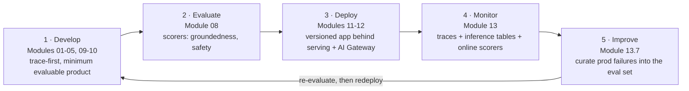
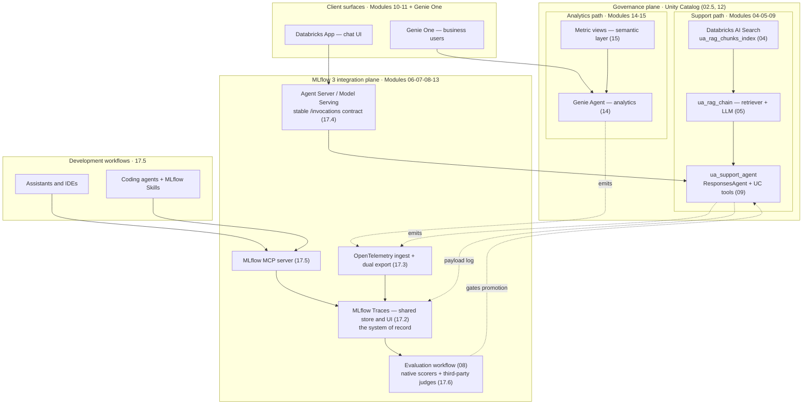

# Reference architectures and unifying GenAI systems  ·  Module 17  ·  Topics 17.1–17.7  ·  [Theory + Hands-on]

> **You are here:** Roadmap **Level 7 · Module 17 — Reference architectures and unifying GenAI systems** (all topics 17.1–17.7). This is the **capstone / synthesis module**. Modules 00–16 built the pieces of the **Unity Airways** stack one at a time; Module 17 steps back and shows how those pieces connect into **one system a review board can sign off on**. The organizing idea comes straight from the book's last chapter: **MLflow is the integration plane** for a GenAI system, and the **MLflow Trace is the shared artifact** that keeps every part of it honest.
> **Prerequisites:** the whole build — **05** (RAG chain), **07** (Tracing), **08** (Evaluation), **09** (Agent Framework / `ResponsesAgent`), **11** (Model Serving / AI Gateway), **12** (guardrails), **13** (monitoring + inference tables), **14/15** (Genie + metric views). You don't need to re-read them; this module references them by number and ties them together.

This page is the **module hub**. It carries one numbered entry per topic (17.1–17.7). There is **no separate module lab** — the real hands-on is the end-to-end **Capstone C4** notebook (deferred), which builds the whole platform. Topic **17.7 links to** the C4 spec rather than duplicating it.

Everything below wraps around the one running artifact you already have — the **Unity Airways support agent** (endpoint `ua-support-agent`, UC model `unity_airways.rag.ua_support_agent`, chat model `databricks-claude-sonnet-4-5`) plus the **Genie analytics** path over `unity_airways.analytics.*` metric views (e.g. `unity_airways.analytics.bookings_metrics`) — and one governing idea: **stop thinking in features, start thinking in planes.**

> 📌 **The one idea that shapes this module — MLflow is the integration plane.** By the time an agent reaches production, calling the model is the easy part. The hard part is getting many moving pieces — app framework, agent runtime, retrieval, tools, background services, IDE assistants, the eval stack — to **operate coherently**. If each speaks a different dialect, every failure is harder to investigate and every improvement is harder to verify. MLflow's role expands from "a tracing library / a prompt tool / an eval API" into the **plane that connects them**: one shared trace, one stable serving contract, one evaluation loop, one protocol for assistants.

---

## TL;DR
- **The 5-phase lifecycle is the architecture (17.1).** Develop → Evaluate → Deploy → Monitor → Improve is not a slideware pipeline — it's a **loop**, and every module you built slots into exactly one phase. B1 Ch2.
- **The trace is the system of record (17.2).** One MLflow Trace is read by product engineers, platform teams, agent developers, and the eval workflow — nobody reconstructs context from scattered logs. Use consistent span types (`AGENT`, `TOOL`, `RETRIEVER`) and searchable tags (`user_id`, `session_id`, `environment`, `app_version`). B1 Ch10.
- **OpenTelemetry makes it cross-stack (17.3).** MLflow 3 Traces are **OpenTelemetry-compatible** with GenAI semantic conventions. **Dual export** sends the same trace to both Databricks MLflow and your existing OTel collector — so GenAI traces join the org's broader observability instead of living on an island.
- **Agent Server is the stable serving layer (17.4).** MLflow **Agent Server** is a FastAPI-based server that exposes agents through an `/invocations` endpoint, validates against the Responses API schema, and wires in tracing automatically — one serving contract for a web chat, a mobile backend, and an internal tool.
- **MCP bridges assistants and IDEs (17.5).** The **MLflow MCP server** lets assistants (Claude Code, Cursor, Codex, Gemini CLI) operate on your trace data directly; **MLflow Skills** package repeatable playbooks so any coding agent runs the same operating model. Databricks also hosts **managed MCP servers** (Genie, AI Search, UC functions, Databricks SQL).
- **Third-party judges plug into one loop (17.6).** MLflow works as a **common scorer interface** — DeepEval, RAGAS, Arize Phoenix, and TruLens run in the *same* evaluation workflow as native scorers, so you can adopt ecosystem innovation without a second, disconnected eval stack.
- **17.7 is the capstone.** Design the end-to-end enterprise reference architecture — see **[Capstone C4](../../capstones/capstone-4-genai-platform.md)**.

## The problem
- You have shipped, in this curriculum, a genuinely capable stack: retrieval (04–05), a governed tool-using agent (09), served and guardrailed (11–12), monitored (13), with a self-serve analytics path (14–15). Each works.
- The review board does not see a stack. It sees **three demos that don't obviously belong to the same system**, and it asks the questions a demo can't answer:
  - When a request goes wrong, **where do I look** — the app logs, the agent runtime, the retrieval service, the gateway, or the eval report?
  - The support agent, the analytics Genie, and a nightly batch job each **emit different signals**. How do I compare them, or trace one user journey across them?
  - A new team wants to call the agent from a mobile backend. Do they **re-implement** streaming, retries, and logging, or is there one contract?
  - Our platform team already runs **OpenTelemetry**. Do GenAI traces show up there, or is this a separate silo nobody watches?
  - A promising **third-party evaluator** (say, a hallucination detector) looks better than ours for one dimension. Adopt it — and fragment the eval stack, or skip it?
- These are **integration** questions, not feature questions. They're what turns "some AI projects" into "a platform we operate."

## Why the naive approach fails
- **"Each component logs its own way."** Then every cross-component failure is a manual archaeology dig across five log formats. The fix is a **shared artifact** — the trace (17.2).
- **"We'll bolt observability on after launch."** GenAI observability isn't a post-launch add-on; it's how you move faster *while shaping the product*. Trace from the first working path (B1 Ch2, "trace-first development") — the same trace then serves debugging, monitoring, dataset construction, human review, and evaluation.
- **"Every client integrates with the agent runtime directly."** Now streaming, retry, and logic drift per entry point, and the agent behaves slightly differently depending on who called it. A **stable serving contract** (Agent Server / Model Serving) localizes that complexity (17.4).
- **"GenAI traces live in their own tool."** A silo nobody watches. **OTel dual export** lets the same trace flow into the org's existing observability platform (17.3).
- **"Adopt the new evaluator by standing up a second eval pipeline."** Two definitions of "good," no comparability. Plug third-party judges into the **one** MLflow evaluation loop instead (17.6).

## What it is
- **Plain-language definition:** a **reference architecture** for enterprise GenAI on Databricks is the picture of how the components you built connect into an operable system — with two shared planes underneath everything: a **governance plane** (Unity Catalog) and an **observability / integration plane** (MLflow 3). MLflow is the integration plane because the trace, the serving contract, and the eval loop all live there and everything else reads from them.
- **Mental model:** think **planes, not boxes**. Boxes (RAG, agent, Genie, monitoring) are the *what*; planes (governance + observability) are the *how it stays coherent*. Two application paths can differ wildly and still be one platform if they share the same two planes.
- **Where it sits:** Modules 00–16 are the boxes. Module 17 draws the planes and the wires. The capstone (17.7 / C4) is where you actually assemble it and defend it.

## Why it matters (for a Databricks FDE)
- **This is the architecture-review conversation.** Customers who got past "can it answer?" (05), "is it safe?" (12), and "will it stay good?" (13) now ask "**is this one system, and can we operate it?**" Module 17 is the answer, and it's the difference between a POC and a signed-off platform.
- **It's the whole book, compressed.** B1's last chapter is explicit: MLflow becomes an **integration plane** — a common artifact in the trace, a serving surface for runtime access, consistent workflows for evaluation and improvement. If you can draw that, you understand the stack.
- **It de-risks heterogeneity.** Real enterprises don't run one language or framework. A request may cross a TypeScript frontend, a Python orchestration layer, a Java retrieval service, and a Go tool backend. A **common trace format pays for itself** the moment the system stops being homogeneous.
- **It maps to the exam and to delivery.** Reference-architecture and lifecycle thinking underpin Domain 1 (Designing) and Domain 4 (Deploying/integrating); the capstone (C4) demonstrates **all 8** domains against a running system, and produces the FDE hand-over kit (Track D).

## Core concepts
- **The 5-phase lifecycle as a loop** — Develop → Evaluate → Deploy → Monitor → Improve, then back to Develop with production evidence. Not linear; the last phase feeds the first (17.1, B1 Ch2).
- **Trace as the shared integration artifact** — the trace is the "system of record for what actually happened across the application." Consistent span types + stable operation names + searchable tags make traces comparable across releases and teams (17.2, B1 Ch10).
- **OpenTelemetry compatibility + dual export** — MLflow 3 Traces speak OTel with GenAI semantic conventions; you can export MLflow traces to an OTel collector *and* bring OTel-instrumented app activity into Databricks (17.3).
- **Stable serving contract** — MLflow Agent Server (FastAPI, `/invocations`, `@invoke()` / `@stream()`, Responses-API validation, auto-tracing) so clients couple to one contract, not to agent internals (17.4). On Databricks, `agents.deploy(...)` + Model Serving is the managed equivalent.
- **MCP as the assistant bridge** — the MLflow MCP server gives assistants a protocol to search/analyze traces and log feedback; managed MCP servers on Databricks expose Genie, AI Search, UC functions, and SQL as governed tools (17.5).
- **MLflow Skills** — packaged, reusable engineering playbooks (instrument tracing, analyze traces, reconstruct chat sessions, set up evaluation, query metrics, onboard, search docs) that any coding agent can follow (17.5).
- **Common scorer interface** — third-party judges (DeepEval, RAGAS, Arize Phoenix, TruLens) participate in the same MLflow evaluation workflow as built-in scorers; one loop, mixed evaluators (17.6).
- **Two planes** — governance (Unity Catalog) and observability/integration (MLflow 3) wrap both application paths (support + analytics). Sharing the planes is what makes it one platform (17.7).

## 🗺️ Visual map

**Diagram 1 — the 5-phase lifecycle as a loop, with the modules that built each phase (17.1).**



*Takeaway: the lifecycle is a loop, not a line. The Improve phase feeds production evidence back into Develop, and the same trace schema and scorers run in every phase so dev and prod stay comparable.*

**Diagram 2 — the centerpiece: MLflow as the integration plane for the whole Unity Airways platform (17.2–17.6, mirrors B1 Figure 10-1).**



*Takeaway: the two application paths (support + analytics) are different, but they sit on the same governance plane (Unity Catalog) and feed the same integration plane (MLflow 3). The trace store is the hub every other MLflow surface reads from — serving emits to it, OTel flows into it, assistants query it through MCP, and the eval workflow scores it.*

---

## 17.1 The 5-phase GenAI lifecycle as architecture  ·  [Theory]  ·  B1 Ch2

- **The five phases** (B1 Ch2, "Applying the lifecycle to Unity Airways"):
  - **Develop** — start with a minimal agent that looks up a booking, answers basic policy questions, and cites sources; instrument it with **MLflow Traces from the first working path**. The goal is a *minimum evaluable product* — the smallest slice that is both useful and measurable.
  - **Evaluate** — turn early findings into a curated set of scenarios (refunds, changes, baggage, disruptions) with **scorers for groundedness and safety** (groundedness requires citing official policy; safety enforces constraints like "never invent fee waivers"). Module 08.
  - **Deploy** — promote a **versioned application behind a controlled serving surface**. Modules 11–12.
  - **Monitor** — collect real questions; reveal issues like drift in refund answers when policy context is missing, or odd behavior when a tool times out. Module 13.
  - **Improve** — introduce targeted changes (tighten retrieval filters, clarify prompt sections), then **validate the new build against the same dataset** before promoting. Module 13.7.
- **Why it's architecture, not process:** the phases are held together by **durable artifacts and decision points** (B1 Table 2-1): a consistent tracing schema, versioned eval datasets, business-aligned scorers, promotion gates, versioned prompts/models/configs, lineage for clean rollback, and cost visibility. The architecture *is* those shared artifacts.
- **The loop is the point:** "instrument early, evaluate consistently, deploy deliberately, monitor reality, and improve with evidence." Improvement is **targeted, not reactive** — you argue from trace evidence and controlled comparisons, not anecdotes.
- **Key names:** Develop / Evaluate / Deploy / Monitor / Improve; minimum evaluable product; trace-first development; durable artifacts; promotion gate.

## 17.2 MLflow Traces as the shared integration artifact  ·  [Theory]  ·  B1 Ch10

- **Traces stop being just observability.** Earlier chapters treated traces as an observability asset; the integration idea is **organizational**: the trace is the **shared artifact that makes the rest of the system easier to operate**.
  - Product engineers inspect request and final response.
  - Platform teams examine latency, failures, and execution paths.
  - Agent developers follow tool calls, retrieval steps, and intermediate decisions.
  - Evaluation workflows score the *same* artifact later — no reconstructing context from scattered logs.
- **It's the system of record** for what actually happened across the application — and it matters more in **heterogeneous** systems (a request crossing a TypeScript frontend, Python orchestration, a Java retrieval service, a Go tool backend). A common trace format pays for itself as diversity grows.
- **A shared store is only as good as its conventions (B1 Ch10):**
  - Use **span types** consistently: `AGENT`, `TOOL`, `RETRIEVER`.
  - Choose **stable names** for recurring operations.
  - Attach searchable **metadata / tags**: `user_id`, `session_id`, `environment`, `app_version`.
  - These make comparable traces easy to find, regressions easy to inspect across releases, and one-off incidents reusable as engineering evidence.
- **In our stack:** the same Unity Airways trace you instrumented in **Module 07** is auto-captured in production (Module 13), scored offline and online with the **Module 08** scorers, and — when it fails — curated into the eval set (13.7). One atom, five jobs.
- **Key names:** shared trace store, span types (`AGENT`/`TOOL`/`RETRIEVER`), stable operation names, searchable tags (`user_id`, `session_id`, `environment`, `app_version`).

## 17.3 OpenTelemetry for cross-stack tracing  ·  [Theory + Hands-on]  ·  B1 Ch10

- **Why it matters:** many production apps already use **OpenTelemetry (OTel)** for distributed tracing across services, gateways, and infrastructure. MLflow's **OTel compatibility** lets GenAI traces join those broader observability workflows instead of living on an island.
- **It works in two directions:**
  1. **Export MLflow traces to an OTel collector** — GenAI traces flow into your existing observability platforms and enterprise pipelines.
  2. **Bring OTel-instrumented app activity into Databricks tracing** — visibility into what happened *upstream* in the app as well as *downstream* in the agent or model.
- **"Dual export"** is B1's word for the goal: the *same* trace reaches **both** MLflow and another OTel destination, so you keep MLflow for GenAI tracing without abandoning the observability tools already in place. The **current mechanism** in the MLflow docs isn't a single `MLFLOW_ENABLE_DUAL_EXPORT` flag — you point OTel at your collector (`OTEL_EXPORTER_OTLP_TRACES_ENDPOINT`) and, to combine MLflow and OTel spans into **one** trace, hand the tracer provider to OTel (`MLFLOW_USE_DEFAULT_TRACER_PROVIDER="false"`) and register MLflow as a destination with `mlflow.tracing.set_destination(...)`.

**[Hands-on] Send spans to an OTel collector and combine them with MLflow (mechanism per current MLflow OpenTelemetry docs):**

```python
import os
import mlflow
from mlflow.entities.trace_location import MlflowExperimentLocation

# 1) Export spans to your external OTel collector via OTLP
os.environ["OTEL_EXPORTER_OTLP_TRACES_ENDPOINT"] = "<collector-endpoint-url>"
os.environ["OTEL_SERVICE_NAME"] = "unity-airways-support"   # optional: groups traces

# 2) Run MLflow AND OpenTelemetry together so both sets of spans land in ONE trace:
#    let OTel own the tracer provider, then add MLflow's span processors on top.
os.environ["MLFLOW_USE_DEFAULT_TRACER_PROVIDER"] = "false"
mlflow.set_tracking_uri("databricks")
mlflow.tracing.set_destination(MlflowExperimentLocation(experiment_id="<experiment-id>"))
```

- **How to verify it worked:** the Unity Airways support-agent traces appear in the MLflow Traces UI **and** show up in your OTel backend (grouped under the `OTEL_SERVICE_NAME`); OTel-emitted and MLflow-emitted spans are stitched into a single request trace, legible end to end.
- **The operating benefit, not the config, is the point:** once traces from different parts of the stack are analyzable in a common environment, debugging stops being a framework-by-framework exercise.
- **Key names:** OpenTelemetry (OTel), OTLP endpoint, `OTEL_EXPORTER_OTLP_TRACES_ENDPOINT`, `OTEL_SERVICE_NAME`, `MLFLOW_USE_DEFAULT_TRACER_PROVIDER`, `mlflow.tracing.set_destination(MlflowExperimentLocation(...))`, GenAI semantic conventions.

> ⚠️ **GOTCHA:** To display OTel traces meaningfully, applications must emit the **expected span types and attributes**. Those field-level mappings evolve faster than the surrounding architecture — B1 deliberately does **not** reproduce them. Get the exact attribute requirements from the current MLflow / Databricks tracing docs. **⚠️ live re-check pending** for the exact semantic-convention field names.

## 17.4 MLflow Agent Server as a stable serving layer  ·  [Theory]  ·  B1 Ch10

- **The problem it solves:** a web chat, a mobile backend, and an internal support tool may all rely on the *same* underlying agent — yet each accumulates its own request handling, streaming logic, retry behavior, and logging conventions. Over time that duplication **fragments** the agent: it behaves slightly differently per entry point, and integration logic is scattered across clients.
- **What Agent Server is (B1 Ch10):** MLflow **Agent Server** gives teams a **stable serving layer in front of the runtime**. Currently it's a **FastAPI-based server** that:
  - exposes agents through an **`/invocations`** endpoint,
  - supports **decorator-based registration** with `@invoke()` and `@stream()`,
  - **validates** requests and responses against the **Responses API schema**, and
  - **wires in MLflow tracing automatically**.
- **The architectural benefit:** client-facing systems integrate with **one serving contract** rather than coupling to the internal details of an agent runtime. That doesn't remove retrieval / tool / orchestration complexity — it **localizes** it, so you can change internal components without forcing every consumer to reimplement its integration layer.
- **On Databricks, the managed equivalent:** `agents.deploy(uc_model_name, version)` creates a **Model Serving** endpoint (our `ua-support-agent`) plus a Review App and feedback model, and enables tracing, inference tables, and monitoring — the same "one stable contract, tracing built in" idea, managed for you (Modules 09, 11, 13).
- **Key names:** MLflow Agent Server, FastAPI, `/invocations`, `@invoke()` / `@stream()`, Responses API schema, one serving contract; managed equivalent `agents.deploy(...)` → Model Serving endpoint.

> 💡 **TIP:** Whether you use MLflow Agent Server (self-managed FastAPI) or `agents.deploy()` (managed Model Serving), the FDE talking point is identical: give consumers **one contract with tracing built in** so the agent behaves the same no matter who calls it. MLflow Agent Server is a **newer MLflow serving feature** — confirm exact status and API on the current MLflow docs before committing a customer.

## 17.5 MCP as the bridge to assistants and IDEs; MLflow Skills for coding agents  ·  [Theory + Hands-on]  ·  B1 Ch10

- **Assistants vs coding agents (B1 Ch10):** *assistants* are AI helpers for investigation and triage; *coding agents* are the more autonomous subset that can also modify code and help implement fixes.
- **The MLflow MCP server** gives assistants and IDE-based agents a **standard, programmatic way to interact with MLflow** — not just as a destination UI. Through it, an assistant can:
  - **search and retrieve** trace data,
  - **analyze** performance and behavior,
  - **log feedback and assessments**,
  - **manage** trace tags and metadata.
- **Why that changes the workflow:** instead of copying dashboard screenshots into a chat, you let the assistant operate on the **underlying trace data directly** — find recurring failure patterns, compare related traces, identify which tool call introduced a regression, or summarize the traces for a particular release. The assistant becomes **part of** the observability workflow, not adjacent to it.
- **MLflow Skills** — described in B1 Ch10 as a newer, agent-authored **playbook set** ("reusable operational knowledge, not just better prompts") so a coding agent uses that MCP access *effectively*. Per the book, the Skills repo covers: **instrument tracing, analyze traces, reconstruct chat sessions, set up evaluation, query metrics, onboard new users, and search the official MLflow docs**, portable across **Claude Code, Cursor, Codex, Gemini CLI, and OpenCode**. (This project itself bundles skills of exactly this shape — e.g. `instrumenting-with-mlflow-tracing`. **Confirm current availability and naming in the MLflow docs** before citing it to a customer.)
- **On Databricks — managed MCP servers:** Databricks hosts **managed, UC-governed MCP servers** for **Genie**, **AI Search**, **UC functions**, and **Databricks SQL** (plus support for custom / external MCP), so an agent can reach governed tools through the same protocol (naming-conventions §2, **Public Preview**).

**[Hands-on] Point an assistant/IDE at the MLflow MCP server** (illustrative MCP client config — take the exact command/URL from current MLflow docs):

```jsonc
// Version gate first:  pip install 'mlflow[mcp]>=3.5.1'
// MCP client config (e.g. a coding-assistant settings file). The MLflow MCP
// server exposes trace search, analysis, and feedback tools (per current docs).
{
  "mcpServers": {
    "mlflow": {
      "command": "uv",
      "args": ["run", "--with", "mlflow[mcp]>=3.5.1", "mlflow", "mcp", "run"],
      "env": {
        "MLFLOW_TRACKING_URI": "databricks",
        "DATABRICKS_HOST": "https://<your-workspace-host>",
        "DATABRICKS_TOKEN": "<token>"
      }
    }
  }
}
```

- **How to verify it worked:** from the assistant, ask "find the Unity Airways support traces with the worst groundedness this week and summarize the common failure" — it should query traces through the MCP server and return an answer grounded in real trace data (rather than you pasting screenshots).
- **Key names:** MLflow MCP server, Model Context Protocol, MLflow Skills, coding agents vs assistants; managed MCP servers (Genie / AI Search / UC functions / Databricks SQL, Public Preview).

> ⚠️ **GOTCHA:** The book states plainly that **at time of writing the MLflow MCP server does not support interacting with traces stored in Unity Catalog** — so the *direction* is clear but the exact workflow still depends on **where your traces are stored today**. The MLflow MCP server is an **experimental** feature; managed MCP servers on Databricks are **Public Preview**. Confirm current maturity and the exact `mcpServers` command before a customer commitment. **⚠️ live re-check pending** on the exact MCP launch command and UC-trace support.

## 17.6 Third-party judges and ecosystem integration  ·  [Theory]  ·  B1 Ch10

- **Evaluation is part of the integration plane too.** A useful platform can't stop at traces and runtime workflows — it needs a **consistent way to measure quality**. MLflow works here as a **common scorer interface** for evaluation methods that come from *outside* the core project.
- **The GenAI eval ecosystem moves fast:** different tools are strong in different areas — conversational quality, retrieval quality, hallucination detection, safety, summarization, agent behavior. The challenge is adopting useful evaluators **without creating a second, disconnected evaluation stack.**
- **How MLflow solves it:** it lets **third-party judges participate in the same evaluation workflow as native scorers.** Today that includes integrations such as **DeepEval, RAGAS, Arize Phoenix, and TruLens**, alongside other third-party judge options in the MLflow scorer framework.
- **The operational effect (bigger than an API convenience):** teams can adopt ecosystem innovation without abandoning **a shared evaluation workflow, a shared results surface, and a shared path from experimentation to production quality control.** You can mix built-in and external evaluators while keeping **one evaluation loop.**
- **In our stack:** the Module 08 `mlflow.genai.evaluate(...)` scorecard (Correctness, RetrievalGroundedness, Safety) that gates promotion of `ua_support_agent` is the *same* loop a RAGAS retrieval-quality judge or a DeepEval hallucination judge would plug into — no parallel pipeline, one scorecard.
- **Key names:** common scorer interface, third-party judges (DeepEval, RAGAS, Arize Phoenix, TruLens), MLflow scorer framework, one evaluation loop.

## 17.7 Designing an end-to-end enterprise GenAI reference architecture (capstone)  ·  [Theory + Hands-on]  ·  all

- **This topic is Capstone C4.** Don't rebuild it here — the full spec (scenario, milestones M1–M5, acceptance criteria, grading rubric, 8-domain cert map, deliverables) lives at **[`capstones/capstone-4-genai-platform.md`](../../capstones/capstone-4-genai-platform.md)**.
- **In two lines:** C4 stitches C1–C3 (the registered `ua_rag_chain`, its `@champion` eval scorecard, and the deployed `ua_support_agent`) into **one governed platform** and adds the layers the earlier capstones didn't touch — Genie analytics (14), metric views (15), a cost/scaling pass (16), and this reference architecture (17). The deliverable is a running platform **plus** an architecture one-pager, a production-readiness checklist, a cert-domain readiness map, and a stakeholder demo script — something a review board can sign off on.
- **How 17 shows up in C4:** milestone **M4** is literally this module — produce the end-to-end reference architecture and the single-page diagram, with the **5-phase lifecycle as structure (17.1)** and **MLflow Traces as the shared integration artifact (17.2)** across the support and analytics paths, plus written-down trade-offs (real-time vs batch, alias vs pinned version, single agent vs Multi-Agent Supervisor).
- **⚠️ The runnable end-to-end capstone notebook is deferred** — it's built later. This hub links the spec; it does not ship `17-7-capstone.py`.

---

## Worked example (Unity Airways, from three demos to one platform)

Walk the same request through the planes and watch the components you built line up.

1. **One request enters (17.4).** A traveler asks the Databricks App "Can I change my flight tomorrow, and what's the fee?" The app calls **one contract** — the `ua-support-agent` Model Serving endpoint (the managed equivalent of MLflow Agent Server). The app doesn't know or care about retrieval or tools internally.
2. **The agent runs on the governance plane (04-05-09).** `ua_support_agent` (a `ResponsesAgent`) retrieves policy chunks from `ua_rag_chunks_index`, calls a UC-function tool to look up the booking, and answers with citations — all governed by Unity Catalog.
3. **One trace records everything (17.2).** The whole path is a single MLflow Trace with `AGENT` / `TOOL` / `RETRIEVER` spans and tags (`session_id`, `app_version`). Product, platform, and agent developers all read this one artifact.
4. **The trace goes cross-stack (17.3).** Dual export sends the same trace to the org's OTel collector, so the platform team sees the GenAI request alongside the rest of their services — no silo.
5. **Assistants operate on it (17.5).** Next morning an on-call engineer asks their IDE assistant, through the **MLflow MCP server** and an **MLflow Skill**, to find low-groundedness traces from last night and summarize the failure. It finds a new-route question the FAQ never covered.
6. **One eval loop scores it (17.6, 08).** The failing traces are scored by the Module 08 scorecard — and if the team wanted a specialized retrieval judge (RAGAS) it would plug into the *same* loop, not a new one.
7. **The loop closes (17.1, 13.7).** The failing traces are curated into the eval set, the FAQ is updated, the new build clears the scorecard, and promotion moves the alias — back to **Develop**. Same trace, whole lifecycle.

**How to verify it worked:** you can point at *one* trace and follow the request across the app, the agent, the retriever, the tool, the OTel backend, the assistant's analysis, and the eval score — and you can name which module and which plane each hop belongs to. That legibility is the reference architecture doing its job.

---

## Uses, edge cases and limitations

| Use it when | Be careful when | Better move |
|---|---|---|
| A review board needs to see one system | You present three separate demos | Draw the two planes (UC + MLflow) and both paths on one page (17.7) |
| Cross-component failures are hard to trace | Each component logs its own way | Standardize the trace: span types + stable names + tags (17.2) |
| The org already runs OpenTelemetry | GenAI traces sit in a silo | Turn on OTel dual export (17.3) |
| Many clients call the same agent | Each reimplements streaming/retry/logging | Put one serving contract in front (Agent Server / `agents.deploy`) (17.4) |
| You want assistants in the debugging loop | You paste screenshots into chat | MLflow MCP server + MLflow Skills on the trace data (17.5) |
| A third-party evaluator is better for one dimension | You stand up a second eval pipeline | Plug it into the one MLflow eval loop (17.6) |

## Common mistakes / gotchas
- Treating MLflow as "just a tracing library" — in a platform it's the **integration plane** (trace + serving + eval + MCP).
- Inconsistent span types / names / tags across teams — then traces aren't comparable and the shared-artifact benefit evaporates (17.2).
- Adding observability after launch instead of tracing from the first working path (17.1, trace-first).
- Coupling every client to the agent runtime instead of one serving contract (17.4).
- Reproducing OTel field-level span mappings from a book/blog — they evolve; read current docs (17.3).
- Expecting the MLflow MCP server to reach **UC-stored traces** today — it doesn't, at time of writing (17.5).
- Adopting a third-party judge by forking the eval stack instead of plugging into the one loop (17.6).
- Rebuilding the C4 capstone spec instead of linking to it (17.7).

## > 📌 IMPORTANT callouts
- **MLflow is the integration plane.** The four load-bearing surfaces: the **trace** (shared artifact, 17.2), the **serving contract** (Agent Server / `agents.deploy`, 17.4), the **eval loop** (native + third-party judges, 17.6), and the **MCP bridge** (assistants + Skills, 17.5) — with **OTel** connecting it to the wider stack (17.3).
- **The lifecycle is a loop and it maps 1:1 to the modules.** Develop (01-05, 09-10) → Evaluate (08) → Deploy (11-12) → Monitor (13) → Improve (13.7) → back to Develop (17.1).
- **Two planes make three demos one platform.** Governance (Unity Catalog) + observability/integration (MLflow 3) wrap both the support and analytics paths. Share the planes and it's a platform; don't and it's a pile of demos (17.7 / C4).

## > 💡 TIP
- On a whiteboard with a customer, draw **planes first** (UC + MLflow), then hang the boxes (RAG, agent, Genie, monitoring) on them. It reframes "which product?" into "how does it stay coherent?" — the architect-level conversation.
- Standardize span types and tags (`user_id`, `session_id`, `environment`, `app_version`) **in dev** — traces carry over unchanged to prod (Module 07 → 13), and the tags are what make cross-release comparison possible.
- MLflow **Agent Server** and **MCP server** are newer/experimental MLflow features — teach them at the level here, then confirm exact status/API on `mlflow.org/docs/latest` before a customer build.

## > ⚠️ GOTCHA
- **B1 is an O'Reilly Early Release (RAW & UNEDITED).** Its Ch10 features are current-direction but fast-moving: MLflow **Agent Server** (FastAPI `/invocations`), **MLflow MCP server** (experimental — no UC-stored-trace support yet), and OTel field mappings all need a **live re-check** before you commit them to a customer.
- **OTel semantic-convention field names evolve** — don't hardcode them from the book; read current MLflow/Databricks tracing docs.
- **AI Gateway on *agent* endpoints supports only inference tables** — guardrails, rate limits, and usage tracking require a Foundation Model or external-model endpoint, not an agent endpoint (carried from Module 11/12). Don't over-claim gateway features on `ua-support-agent` in the architecture.
- **Managed MCP servers** (Genie / AI Search / UC functions / SQL) are **Public Preview**; **Unity AI Gateway** budgets are **Beta**. Label maturity in the one-pager.

## 📝 Notes
- _Space for your own notes: which of the four integration surfaces (trace / serving / eval / MCP) your customer is missing, and whether their GenAI traces reach their existing OTel backend._

**Self-check (5 questions)**
1. Name the five lifecycle phases in order and give the module (or modules) that built each. Which phase feeds back into which, and why does that make it a loop, not a line?
2. Why is the MLflow Trace called the "shared integration artifact"? Name three roles that read the same trace, and the four things you standardize (span types + one more) to keep traces comparable.
3. What does OTel **dual export** do, and which two environment variables turn it on? What's the one thing B1 refuses to reproduce, and why?
4. What is MLflow Agent Server, what endpoint does it expose, and what schema does it validate against? What is the managed Databricks equivalent, and what does it wire up automatically?
5. What can an assistant do through the MLflow MCP server, what do MLflow Skills add on top, and what is the current limitation about Unity-Catalog-stored traces?

## How this maps to the certification
- **Domain 1 — Designing GenAI applications** and **Domain 4 — Deploying + integrating:** the reference-architecture and lifecycle thinking here is the design/deploy backbone — serving contracts, integration surfaces, and the Develop→Improve loop are exactly what design and deployment questions probe (B2 Ch10 blueprint).
- **This is the integrative capstone's module.** C4 (17.7) demonstrates **all 8** exam domains at once against a running platform — where C1 proved Domains 2–3, C2 proved 5 and 7, and C3 proved 4 and 6, **C4 proves the whole blueprint end to end** and adds the scaling (Domain 8) and analytics/semantic-layer material. Walk the C4 cert-domain map to self-check readiness.

## Sources
- 📘 **B1 — *Practical MLflow for Generative AI on Databricks*** (O'Reilly Early Release, RAW & UNEDITED), **Ch 10 — "Bringing It All Together: Development, Deployment, and Collaboration"** (primary): MLflow as an integration plane (Figure 10-1); **MLflow Traces as the Shared Integration Artifact** (span types `AGENT`/`TOOL`/`RETRIEVER`, stable names, tags `user_id`/`session_id`/`environment`/`app_version`); **OpenTelemetry for Cross-Stack Tracing** (two directions; dual export — the book's illustrative env vars include a `MLFLOW_ENABLE_DUAL_EXPORT` flag that is **superseded by the current docs mechanism** cited below, so teach that instead); **MLflow Agent Server** (FastAPI, `/invocations`, `@invoke()`/`@stream()`, Responses API schema, auto-tracing); **MLflow MCP** (experimental; search/analyze/feedback/tags; no UC-stored-trace support yet); **MLflow Skills for Coding Agents** (playbooks; Claude Code, Cursor, Codex, Gemini CLI, OpenCode); **Integrating the Ecosystem Through Third-Party Judges** (DeepEval, RAGAS, Arize Phoenix, TruLens; common scorer interface); Road Ahead. **Ch 2 — "End-to-End GenAI Application Lifecycle with MLflow"**: the five phases (Develop / Evaluate / Deploy / Monitor / Improve; "Applying the lifecycle to Unity Airways"), Table 2-1 (durable-artifact do/don't), trace-first development, minimum evaluable product.
- 📗 **B2 — *Databricks Certified GenAI Engineer Associate Study Guide*** — Ch 10 (exam blueprint) for the domain map that C4 (17.7) demonstrates end to end.
- 📎 **Project cheat-sheet** — `.claude/skills/genai-teacher/references/naming-conventions.md`: **§1** MLflow 3 Traces are OpenTelemetry-compatible with GenAI semantic conventions; **§2** `ResponsesAgent` + `agents.deploy(...)` and **managed MCP servers** (Genie / AI Search / Databricks SQL / UC functions — **Public Preview**); **§6** AI Gateway / **Unity AI Gateway** budgets (Beta). Verified July 2026 — re-verify Beta/Preview live.
- 🌐 **MLflow / Databricks docs** (bounded curl, Jul 2026): `mlflow.org/docs/latest/genai/tracing/` confirms **OpenTelemetry** + **Semantic Convention**; **`mlflow.org/docs/latest/genai/tracing/app-instrumentation/opentelemetry.md`** confirms the current OTel export mechanism — `OTEL_EXPORTER_OTLP_TRACES_ENDPOINT` for OTLP export, and `MLFLOW_USE_DEFAULT_TRACER_PROVIDER="false"` + `mlflow.tracing.set_destination(MlflowExperimentLocation(...))` (import `from mlflow.entities.trace_location import MlflowExperimentLocation`) to combine MLflow and OTel spans into one trace (there is **no** `MLFLOW_ENABLE_DUAL_EXPORT` flag in current docs); **`mlflow.org/docs/latest/genai/mcp.md`** confirms the MCP launch (`pip install 'mlflow[mcp]>=3.5.1'`; `"command": "uv"`, `"args": ["run","--with","mlflow[mcp]>=3.5.1","mlflow","mcp","run"]`); `mlflow.org/docs/latest/llms.txt` confirms **MLflow Agent Server** ("Serve agents as production REST APIs with MLflow's FastAPI-based agent server. Automatic tracing, validation, and streaming support.") and **MLflow MCP Server** ("Connect AI assistants and coding tools to MLflow using MCP … from Claude Code, Codex, Cursor, and Gemini CLI"); `docs.databricks.com` llms.txt confirms **Model Context Protocol (MCP) on Databricks** and AI Gateway governance of MCP servers. Exact managed-MCP URL patterns and OTel semantic-convention field names are JS-rendered / evolving — **⚠️ live re-check pending**.
- 🏗️ **Capstone C4** (this project) — `capstones/capstone-4-genai-platform.md` (+ `.html`): the end-to-end enterprise reference-architecture capstone that realizes ★ 17.7. Linked, not duplicated.
- 🧩 **Cross-referenced built modules:** 04 AI Search · 05 RAG chain · 07 Tracing · 08 Evaluation · 09 Agent Framework · 10 Agent Bricks · 11 Serving / AI Gateway · 12 Guardrails · 13 Monitoring · 14/15 Genie + metric views · 16 Cost & scaling.

---

### Next → **Phase P7 — the Tracks (Track C cert / Track D FDE) + the C4 capstone notebook**
Module 17 is the **last content module**. The stack is complete: built (00–10), productionized (11–13), made conversational (14–15), right-sized (16), and now **unified into one reference architecture** (17). From here:
- **Track C — Certification:** use the **[C4 cert-domain readiness map](../../capstones/capstone-4-genai-platform.md)** as your mock exam — if you can point at a component for each of the 8 domains, you're ready.
- **Track D — FDE delivery:** turn the platform into the hand-over kit (architecture one-pager, POC scorecard, production-readiness checklist).
- **The finale — the C4 capstone notebook (deferred):** the runnable end-to-end build that assembles C1–C3 plus the analytics, cost, and architecture layers into one governed, observed, budgeted platform. That's the last thing you build.
