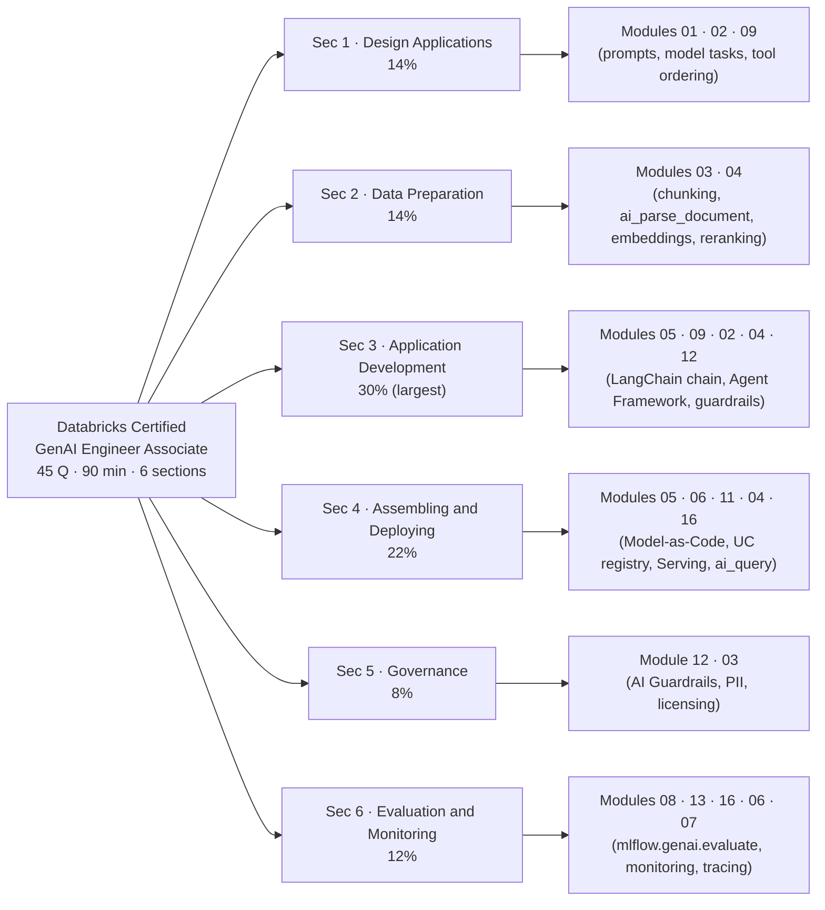
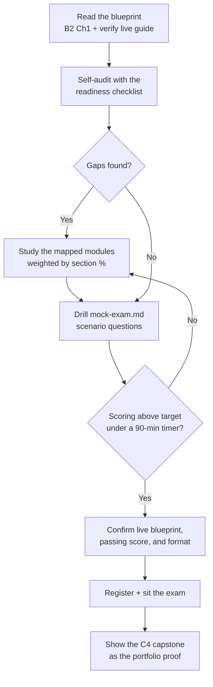

# Certification prep hub  ·  Track C · Topics C.1–C.10  ·  [Theory]

> **You are here:** Roadmap **Track C — Certification prep** (cross-cutting, topics C.1–C.10). This track does not teach new product features. It re-organizes the 18 teaching modules (00–17) you already built around one thing: the **Databricks Certified Generative AI Engineer Associate** exam. Run it in parallel with Levels 1–7.
> **Prerequisites:** none to start. To be *exam-ready*, you want the core build modules done: **00–09, 11, 12, 13, and 16**. The mock-exam question bank lives next to this file at `mock-exam.md`.

This page is the **cert-prep hub**. It carries the exam format, the **official 6-section blueprint with weights**, a **section → curriculum-module map**, a **readiness checklist**, and a study plan. Topic **C.10** (mock exams + readiness + practice questions) is delivered as the companion `mock-exam.md`.

> 📌 **The one idea that shapes this track — the exam tests applied engineering judgment on the *Databricks* GenAI stack, not trivia.** Almost every question is a short scenario ("you need X under constraint Y — pick the best approach"). If you can build and operate the Unity Airways stack end to end, you can pass. Study to the **weights**, practice on **scenarios**, and confirm the live blueprint before you sit.

---

## TL;DR
- **Format (📗B2 Ch1, Table 1-1):** **45 questions**, **90 minutes**, **$200 USD**, online-proctored at webassessor.com/databricks, **no aids**, valid **2 years**. Some questions are **unscored** (indistinguishable from scored — treat every one as counting).
- **Blueprint (📗B2 Ch1, Table 1-2):** **6 official sections** — Design Applications **14%**, Data Preparation **14%**, **Application Development 30%**, Assembling and Deploying **22%**, Governance **8%**, Evaluation and Monitoring **12%**. More than half the exam is build + deploy.
- **Passing score is NOT stated in the study guide.** Databricks Associate exams are commonly reported around 70%, but that number is *not* in B2 — **⚠️ live re-check pending**; confirm on the official exam guide before you rely on it.
- **Section → module map** below turns each blueprint section into the exact modules you already built. Study the high-weight sections (App Dev, Assembling/Deploying) hardest.
- **The ROADMAP's C.2–C.9 uses an 8-domain (book-chapter) framing.** The *official* blueprint uses **6 sections**. This hub teaches the **6 official sections as the source of truth** and cross-maps them to the ROADMAP domains and modules.
- **Everything is Databricks-current:** the exam and your prep use `mlflow.genai.evaluate`, `ResponsesAgent`, **Databricks AI Search** (SDK still `databricks-vectorsearch`), `databricks-langchain`, `ai_query`, AI Gateway guardrails, and UC model registration. Do not answer with legacy names.

## The problem
- You have built 18 modules of real Databricks GenAI capability. Now you want the credential that proves it — and a customer, manager, or your own plan is asking "when are you certified?"
- The exam is short and dense: **45 scenario questions in 90 minutes** is **~2 minutes each**. There is no documentation lookup and no partial credit for "knowing the area." You either pick the best answer or you don't.
- Candidates fail not because they lack knowledge but because they **studied evenly across topics that are unevenly weighted**, memorized definitions instead of practicing decisions, or walked in carrying **legacy product names** the current exam no longer uses.
- For an FDE this is doubly important: the credential is table-stakes with customers, and the *act* of mapping your knowledge to a blueprint is exactly the muscle you use when you scope a customer's GenAI project.

## Why the naive approach fails
- **"I'll read the whole study guide cover to cover once."** Even coverage wastes your best hours. **Application Development is 30%** and **Assembling and Deploying is 22%** — together **more than half the exam**. Governance is **8%**. Reading Ch7 as hard as Ch4 is a bad trade.
- **"I'll memorize the API signatures."** The exam rewards *judgment* — "which guardrail for this risk," "batch or real-time here," "which scorer needs ground truth." Rote signatures without the decision behind them lose scenario questions.
- **"I learned this from a 2024 blog, the names are close enough."** They are not. Answering `mlflow.evaluate(model_type="databricks-agent")` instead of `mlflow.genai.evaluate`, or "Vector Search" concepts with the wrong SDK, or `ChatModel` instead of `ResponsesAgent`, is how you pick a plausible-but-wrong distractor.
- **"I'll trust the weights I saw somewhere online."** Blueprints change. Ground your plan in B2 Ch1, then **verify the live exam guide** — the section names and weights, and the passing score, can move between exam versions.

## What it is
- **Plain-language definition:** the *Databricks Certified Generative AI Engineer Associate* exam validates that you can **design, build, deploy, govern, and evaluate** GenAI/RAG systems on Databricks. Track C is the study system that maps your built modules onto its blueprint and drills you on exam-style scenarios.
- **Mental model:** think of the blueprint as a **rubric a customer would use to grade your solution**. Each section is a real phase of a GenAI project — design it, prepare the data, build it, deploy it, govern it, evaluate and monitor it. The exam samples that rubric in proportion to how much each phase matters in practice.
- **Where it sits:** cross-cutting. It sits *on top of* the whole curriculum and points back into it. It teaches nothing new; it re-frames what you know for a specific, timed, scenario-based test.

## Why it matters (for a Databricks FDE)
- **The credential is currency with customers.** "Databricks Certified GenAI Engineer" tells a customer you can be trusted to architect their agent, not just demo one.
- **The blueprint is a discovery checklist in disguise.** Its six sections are the six phases you walk a customer through. Learning to think in the blueprint sharpens how you scope real POCs (see Track D).
- **It forces currency.** Studying to the current exam is a forcing function to drop legacy names (`ChatModel`, "Vector Search" SDK confusion, old eval APIs) and speak the product as it ships today.
- **It closes the loop on the capstone.** The **C4 / Module-17 capstone** — the full Unity Airways enterprise reference architecture — is the portfolio piece that *demonstrates* everything the exam *tests*. Certificate + capstone is the complete FDE story.

## Core concepts
- **Exam blueprint** — the official document that lists the sections, their objectives, and their **weights** (share of scored questions). The authoritative reference; B2 Ch1 reproduces it, but the live guide wins on conflicts.
- **Section (a.k.a. domain)** — one weighted grouping of related objectives. The official blueprint has **6**. The ROADMAP's C.2–C.9 splits the same material into **8** book-chapter domains; both describe the same knowledge.
- **Weighting** — the percentage of the exam a section contributes. Drives where your study hours go.
- **Scored vs unscored questions** — some items are experimental and do not count, but are **indistinguishable** from scored ones. Answer every question as if it counts; never gamble on "this one's probably unscored."
- **Scenario question** — a short business/technical situation with constraints (cost, latency, governance, quality) that asks for the *best* approach. The dominant question style.
- **Multiple-choice / multiple-selection** — most are single-best-answer; some ask you to select several correct options. Read the stem for "select all that apply."
- **Readiness checklist** — a can-you-do-this-yet self-audit, organized by section, grounded in the built Unity Airways stack.

## 🗺️ Visual map

**The blueprint → curriculum map: each of the 6 official exam sections routes to the modules you already built.**

*Takeaway: the exam is not a separate body of knowledge. It is your curriculum, re-weighted. Study time should follow the percentages, not the module numbers.*

**The study-path flow: from "where am I" to "sit the exam."**

*Takeaway: study is a loop — audit, fill gaps by weight, drill scenarios under a timer, re-audit — then a final live-blueprint check before you register.*

---

## How it works — deep dive

### C.1 — Exam format, blueprint, and how to read the weights  ·  [Theory]

**Exam format (📗B2 Ch1, Table 1-1):**

| Attribute | Detail |
|---|---|
| Number of questions | **45** (multiple-choice / multiple-selection) |
| Time limit | **90 minutes** (~2 min/question) |
| Registration fee | **$200 USD** (may vary by region) |
| Delivery | **Online proctored** at `webassessor.com/databricks` |
| Allowed aids | **None** — no documentation access during the exam |
| Languages | English, 日本語, Português BR, 한국어 |
| Prerequisites | **None** required; **6+ months hands-on** recommended |
| Validity | **2 years**, then recertify |
| Passing score | **Not stated in B2.** Commonly reported ~70% for Databricks Associate exams — **⚠️ verify on the live guide (live re-check pending).** |

- **Unscored questions exist.** Some items are experimental and do not count toward your score, but you cannot tell which. Treat all 45 as scored.
- **The questions are applied.** Expect scenarios that describe a business or technical problem and ask for the best solution — not "define embedding." Time management matters because 90 minutes for 45 scenarios leaves little room to overthink.

**Official blueprint — 6 sections and weights (📗B2 Ch1, Table 1-2):**

| # | Official section | Weight | What it tests (from the syllabus) |
|---|---|---|---|
| 1 | **Design Applications** | **14%** | Design prompts for a target format; pick model tasks for a business need; choose chain components; translate business goals to pipeline inputs/outputs; define and **order tools** for multi-stage reasoning. |
| 2 | **Data Preparation** | **14%** | Choose a **chunking** strategy for a document structure and model limits; filter noise; pick the right extraction package; write chunked text to **Delta/UC**; identify source docs; build prompt/response pairs; use retrieval-eval metrics; explain **reranking**. |
| 3 | **Application Development** | **30%** | LangChain / MLflow / Vector Search; build tools; prompt formats and **metaprompts**; guardrails; augment prompts with user context; **agent prompt templates**; select the best LLM / embedding context length by attributes and metrics; use the **Agent Framework** to build agentic systems. |
| 4 | **Assembling and Deploying Applications** | **22%** | Code a chain as a **PyFunc** with pre/post-processing; control **resource access** from serving endpoints; RAG basic elements (flavor, embedding, retriever, dependencies, input examples, **signature**); **register to UC via MLflow**; sequence an endpoint deploy; **create and query a Vector Search index**; serve with **Foundation Model APIs**; **batch `ai_query()`**. |
| 5 | **Governance** | **8%** | **Masking** as a guardrail; guardrail techniques against malicious input; legal/licensing constraints on data sources; recommend alternatives to problematic source text. |
| 6 | **Evaluation and Monitoring** | **12%** | Choose an LLM from **quantitative metrics**; pick monitoring metrics; **evaluate RAG with MLflow**; inference logging; control cost; **inference tables + agent monitoring**; identify **judges that require ground truth**; compare the eval vs monitoring phases. |

- **Weights add to 100%** (14 + 14 + 30 + 22 + 8 + 12). Build-and-deploy (Sections 3 + 4) is **52%** of the exam.
- **Read the weights as a study budget.** If you have 20 hours, roughly 6 go to App Dev, 4–5 to Assembling/Deploying, and ~1.5 to Governance.

> ⚠️ **GOTCHA:** the ROADMAP frames **8 domains** (C.2–C.9), one per study-guide chapter (Ch2–Ch9). The **official blueprint has 6 sections**. They cover the same material — the 8-domain view just splits *MLflow & UC* (Ch6) and *Scaling* (Ch9) into their own domains, whereas the official blueprint folds them into **Application Development**, **Assembling and Deploying**, and **Evaluation and Monitoring**. Teach and study to the **6 official sections + weights**; use the 8-domain view only as a reading order.

### C.2–C.9 — Section → curriculum-module map  ·  [Theory]

Each official section, the modules that cover it, and the ROADMAP domain it corresponds to.

| Official section (weight) | Primary modules | Also draws on | ROADMAP domain (book ch) |
|---|---|---|---|
| **1 · Design Applications (14%)** | **01** GenAI/LLM fundamentals + FM APIs · **02** Prompt engineering · **09** Agent fundamentals (tool definition/ordering) | 05 (chain components), 00 (platform) | C.2 Domain 1 · 📗Ch2 |
| **2 · Data Preparation (14%)** | **03** Data prep, chunking, `ai_parse_document`/`ai_extract`, Lakeflow SDP · **04** Embeddings, **AI Search**, hybrid, **reranking**, retrieval eval | 15 (curated tables) | C.3 Domain 2 · 📗Ch3 |
| **3 · Application Development (30%)** | **05** RAG chain (`databricks-langchain`, Model-as-Code) · **09** **ResponsesAgent** + Agent Framework, tools · **02** prompts/metaprompts + Prompt Registry | 01 (model selection), 04 (retriever), 12 (guardrails in-app), 08 (qualitative assessment), 10 (Agent Bricks, no-code path) | C.4 Domain 3 · 📗Ch4 (+ Ch6) |
| **4 · Assembling and Deploying (22%)** | **05** Model-as-Code chain · **06** MLflow core + **UC Model Registry** · **11** **Model Serving**, AI Gateway, batch `ai_query` · **04** create/query AI Search index | 16 (`ai_query` suitability, endpoint optimization), 17 (reference architecture) | C.5 Domain 4 · 📗Ch5 (+ Ch9) |
| **5 · Governance (8%)** | **12** Responsible GenAI: **AI Guardrails**, PII, governance | 03 (source licensing/curation), 00 (Unity Catalog) | C.7 Domain 6 · 📗Ch7 |
| **6 · Evaluation and Monitoring (12%)** | **08** `mlflow.genai.evaluate`, LLM-as-a-judge, scorers · **13** production monitoring, inference tables, scorers-as-monitors | 16 (cost control), 06 (MLflow), 07 (Tracing feeds eval + monitoring) | C.8 Domain 7 · 📗Ch8 (+ Ch9) |

- **Cross-cutting foundations** underneath Sections 3, 4, and 6: **Module 06** (MLflow core) and **Module 07** (Tracing). Tracing is not its own exam section, but traces are where evaluation reads retrieved context and where monitoring reads production behavior — know it.
- **Beyond the core blueprint but valuable context:** **10** Agent Bricks (no/low-code agents), **14** AI/BI Genie, **15** metric views, **17** reference architectures. Agent *Framework* (code agents, Module 09) is explicitly on the blueprint under Application Development; Agent *Bricks* is the managed path and shows up as "which approach fits" judgment.

### C.10 — Mock exams, readiness checklist, and practice  ·  [Hands-on]

- **The practice bank is the companion file** `mock-exam.md`: ~32 **original**, exam-style scenario questions distributed across the six sections by weight, each with options A–D, the correct answer, a one-line rationale, and the module it maps to.
- **Drill under real conditions.** Set a **90-minute timer**, do a full pass without notes, then review every rationale — right *and* wrong. The review is where the learning is.
- **Loop with the checklist.** After a mock, take any missed question back to the readiness checklist item and the module it maps to. Re-study, re-drill.

> 🚫 **Exam integrity:** the practice questions are **original**, written to test the *concepts* in the exam style. They are **not** real exam items and must never be treated as a leaked question bank. Real exam content is confidential.

---

## Readiness checklist

Work top to bottom. If you cannot do an item from memory (no docs — the exam has none), it is a gap. Grouped by official section; the module to revisit is in brackets.

**Section 1 — Design Applications (14%)**
- [ ] Write a prompt that forces a **specific output format** (JSON, table, bullet list) and explain why format control matters. [02]
- [ ] Given a business need, pick the right **model task** (classify vs summarize vs generate vs extract) and the right **AI Function** or FM call. [01, 03]
- [ ] Choose the **components of a chain** for a required input/output, and explain what each stage does. [05]
- [ ] **Define and order tools** for a multi-step agent (retrieve → compute → respond) and say why order matters. [09]

**Section 2 — Data Preparation (14%)**
- [ ] Pick a **chunking strategy** for a given document structure and model context limit, and justify chunk size + overlap. [03]
- [ ] Choose the right **extraction path** (`ai_parse_document` / `ai_extract` vs a Python parser) for a source format. [03]
- [ ] Write curated, chunked text to a **Delta table in Unity Catalog** and prepare it for indexing. [03]
- [ ] Build an **AI Search** index (Delta Sync vs Direct Vector Access), pick an **embedding model** and **dimension**, and explain **hybrid search** and **reranking**. [04]
- [ ] Use **retrieval-evaluation metrics** to decide whether retrieval is good enough. [04, 08]

**Section 3 — Application Development (30%) — study hardest**
- [ ] Build a RAG chain with `databricks-langchain` (`ChatDatabricks`, `DatabricksVectorSearch`) and log it with **Model-as-Code** (`mlflow.models.set_model`). [05]
- [ ] Author an agent as a **`ResponsesAgent`** and attach tools (**`UCFunctionToolkit`**, a vector-search retriever tool) via the **Agent Framework**. [09]
- [ ] Write **metaprompts** that reduce hallucination and prevent data leakage; version prompts in the **MLflow Prompt Registry**. [02]
- [ ] **Select an LLM / embedding context length** for a task from model-card attributes and evaluation metrics. [01, 04]
- [ ] Choose between a **code agent (Agent Framework)** and a **no-code Agent Bricks** path for a scenario. [09, 10]
- [ ] Apply **in-app guardrails** and qualitatively assess responses for quality and safety. [12, 08]

**Section 4 — Assembling and Deploying (22%) — study hard**
- [ ] List the **RAG deployment elements**: model flavor, embedding model, retriever, dependencies, input examples, **model signature**. [05, 06]
- [ ] **Register a model to Unity Catalog** with MLflow (`set_registry_uri("databricks-uc")`) and manage **aliases/tags**. [06]
- [ ] **Sequence the deploy** of a RAG/agent endpoint (`agents.deploy(...)`), and control **resource access** from the serving endpoint. [11]
- [ ] **Create and query a Vector Search index** and identify the **resources** needed to serve a RAG app. [04, 11]
- [ ] Serve an LLM with **Foundation Model APIs** and distinguish **pay-per-token vs provisioned throughput**. [11, 16]
- [ ] Decide when a workload belongs in **batch `ai_query()`** vs an interactive endpoint. [16, 11]

**Section 5 — Governance (8%)**
- [ ] Choose a **guardrail** (safety filter, **PII detection/masking**, topic restriction) for a stated risk, and know where it attaches (**FM/external endpoint via AI Gateway**, not the agent endpoint). [12]
- [ ] Apply **masking** to meet a data-protection or performance objective. [12]
- [ ] Reason about **legal/licensing** constraints on source data and recommend an alternative when source text is problematic. [03, 12]

**Section 6 — Evaluation and Monitoring (12%)**
- [ ] Run **`mlflow.genai.evaluate(data=, predict_fn=, scorers=[...])`** and choose the right built-in scorers. [08]
- [ ] Identify which **judges/scorers require ground truth** (e.g. `Correctness`) vs which do not (e.g. `RelevanceToQuery`, `Safety`). [08]
- [ ] Select an **LLM from quantitative metrics** and pick **monitoring metrics** for a deployment. [08, 13]
- [ ] Read **inference tables** and set up **scorers-as-monitors** on a live endpoint; compare the **evaluation vs monitoring** phases. [13, 07]
- [ ] Apply **Databricks cost-control** features (right-size model/context, cache, batch, `scale_to_zero`, AI Gateway budgets). [16]

**Exam-day readiness**
- [ ] I can finish a full 45-question mock in **under 90 minutes** and score consistently above my target.
- [ ] I have **verified the live blueprint** (section names, weights, and passing score) on the official exam guide.
- [ ] I am fluent in **current names** — `mlflow.genai.evaluate`, `ResponsesAgent`, **AI Search** (SDK `databricks-vectorsearch`), `databricks-langchain`, `ai_query`, AI Gateway, **Genie Agents** — and will not pick a legacy-named distractor.

---

## Worked example (Unity Airways, mapping the build to the blueprint)

You built the Unity Airways support system across the curriculum. Here is how it *is* the exam:

1. **Design (Sec 1, 14%):** you chose a **RAG + tool-using agent** pattern, designed the support prompt, and ordered the tools (search the knowledge base → look up the booking → answer). That is every Design Applications objective.
2. **Data prep (Sec 2, 14%):** you parsed policy PDFs with `ai_parse_document`, chunked them, wrote `unity_airways.rag.ua_rag_chunks`, embedded with `databricks-gte-large-en`, and built `ua_rag_chunks_index` with hybrid search + reranking. That is Data Preparation.
3. **Build (Sec 3, 30%):** you wrote the chain with `databricks-langchain`, authored `ua_support_agent` as a **`ResponsesAgent`**, added a `UCFunctionToolkit` tool and a vector-search retriever tool, and versioned the prompt. That is Application Development — the biggest slice.
4. **Deploy (Sec 4, 22%):** you logged with Model-as-Code, registered to UC, and deployed the **`ua-support-agent`** serving endpoint; the nightly ticket-scoring runs as batch **`ai_query()`**. That is Assembling and Deploying.
5. **Govern (Sec 5, 8%):** you put **AI Guardrails** (safety + PII) on the **`ua-support-llm`** Foundation Model endpoint the agent calls, and vetted source-doc licensing. That is Governance.
6. **Evaluate + monitor (Sec 6, 12%):** you ran **`mlflow.genai.evaluate`** with `Correctness` (ground-truth) and `RetrievalGroundedness`, then set scorers-as-monitors on the endpoint's inference tables and a `bookings_metrics` dashboard. That is Evaluation and Monitoring.

**How to verify you're ready:** if you can narrate the six steps above *and* justify each choice against a constraint (cost, latency, governance, quality), you are reasoning the way the exam scores. Then confirm it under a timer with `mock-exam.md`.

---

## Uses, edge cases and limitations

| Situation | Watch out for | Better move |
|---|---|---|
| Planning study time | Reading every chapter equally | Budget by **weight** — App Dev (30%) + Deploy (22%) first |
| Weights you saw online | Blueprints drift between versions | Ground in **B2 Ch1**, then **verify the live guide** |
| Passing score | Assuming "70% for sure" | It is **not in B2** — verify live; treat as pending |
| A question naming an old API | Picking the familiar legacy option | Answer with the **current** name (`mlflow.genai.evaluate`, `ResponsesAgent`, AI Search) |
| A "select all that apply" item | Choosing one and moving on | Re-read the stem — multiple-selection items exist |
| Running low on time | Overanalyzing one hard question | Flag it, move on — ~2 min/question, and unscored items may be in the mix |
| After a wrong mock answer | Just noting the letter | Trace it to the **readiness item + module**, re-study, re-drill |

## Common mistakes / gotchas
- Studying evenly instead of to the **weights** — App Dev + Deploy are 52% of the exam.
- Memorizing definitions instead of **practicing decisions** — the exam is scenario-based.
- Carrying **legacy product names** into the exam (`ChatModel`, `mlflow.evaluate(model_type=...)`, "Databricks Vector Search SDK" confusion). The SDK is still `databricks-vectorsearch` even though the product is **AI Search**.
- Trusting a memorized weight table or a "70% pass" number without checking the **live blueprint**.
- Treating some questions as "probably unscored" and coasting — you cannot tell which, so answer all 45 with care.
- Confusing where guardrails attach: **AI Gateway guardrails go on the FM/external endpoint**, not on the agent serving endpoint (which supports inference tables only).
- Forgetting which scorers need **ground truth** (`Correctness`) vs which do not (`RelevanceToQuery`, `Safety`) — a recurring Evaluation-and-Monitoring trap.

## > 📌 IMPORTANT callouts
- **Study to the weights.** 45 questions, and **more than half** come from Application Development (30%) and Assembling and Deploying (22%). Governance is only 8%.
- **The blueprint is authoritative, and the live version wins.** B2 Ch1 is your grounded starting point; **verify the current sections, weights, and passing score** on the official exam guide before you register.
- **The exam is applied.** Practice picking the *best* approach under a constraint, in ~2 minutes, with no documentation.

## > 💡 TIP
- Take one full timed mock **early** to find your weak sections, then spend your study hours where the weights *and* your gaps overlap.
- Keep a personal "current-vs-legacy names" flashcard from the naming cheat-sheet — most trap distractors are old names.
- Narrate the **Unity Airways build** out loud, section by section. If you can justify every choice, you can answer the scenario version of it.
- Finish the **C4 capstone** — it is both revision *and* the portfolio artifact you show after you pass.

## > ⚠️ GOTCHA
- **Passing score is not in B2** — do not state 70% as fact. **⚠️ Live re-check pending.**
- **Weights and section names can change** between exam versions — the 14/14/30/22/8/12 split is from B2 Ch1 (verify live).
- **6 official sections, not 8.** The ROADMAP's 8-domain view is a reading order, not the exam structure.
- **No documentation during the exam** — everything must be internalized. Registration fee and languages may vary by region.

## 📝 Notes
- _Space for your own notes, weak-area list, and mock-exam scores as you prepare._

**Self-check (5 questions)**
1. How many questions, how long, and how many official sections does the exam have? Which two sections together make up more than half of it?
2. What are the six official sections and their weights? Which one is the largest, and which modules cover it?
3. Is the passing score stated in the study guide? What should you do about it before you register?
4. Give two examples of legacy names that would be *wrong* answers today, and the current name for each.
5. Which built-in evaluation scorer requires ground truth, and which section of the blueprint tests that?

## How this maps to the certification
- **This entire track *is* the certification map.** Every teaching module (00–17) is cross-referenced above to one of the **6 official sections**. The exam samples those sections at **14 / 14 / 30 / 22 / 8 / 12 percent**.
- The companion `mock-exam.md` distributes its ~32 original practice questions across the same six sections in proportion to those weights.

## Sources
- 📗 **B2 — *Databricks Certified Generative AI Engineer Associate Study Guide* (Rajaniesh Kaushikk, O'Reilly, 2026), Ch 1 "Exam Details and Resources"** (primary): **Table 1-1 Exam format** (45 questions, 90 minutes, $200 USD, online-proctored at webassessor.com/databricks, no aids, languages EN/JA/PT-BR/KO, no prerequisites but 6+ months hands-on recommended, 2-year validity); **scored vs unscored** questions; **Table 1-2 Official exam domains and weightings** (Design Applications 14%, Data Preparation 14%, Application Development 30%, Assembling and Deploying Applications 22%, Governance 8%, Evaluation and Monitoring 12%); the per-section objective breakdowns (Sections 1–6); Key Preparation Strategies. *Early Release — RAW & UNEDITED; the passing score is not stated, and weights may change — verify against the live guide.*
- 🌐 **Official exam guide (verify current blueprint here):** `https://www.databricks.com/learn/certification/generative-ai-engineer-associate` — the live page is JavaScript-rendered and not reliably readable by a simple fetch, so **section names, weights, passing score, and fee must be confirmed in the browser. ⚠️ Live re-check pending.**
- 🧭 **naming-conventions.md** (verified July 2026) — current product names the exam and your answers must use: `mlflow.genai.evaluate`; **`ResponsesAgent`** (not `ChatModel`); **Databricks AI Search**, SDK still `databricks-vectorsearch`; `databricks-langchain`; `ai_query`; AI Gateway guardrails; **Genie Agents**.
- 📎 **Built modules cross-referenced (not re-taught):** 00–09, 11, 12, 13, 16, 17. The **C4 capstone** (Module 17) is the portfolio proof.

---

### Next → sit the exam, and show the **C4 capstone**
Track C does not have a "next module" — its finish line is the **exam itself**. Two moves close it out: (1) **verify the live blueprint** (sections, weights, passing score, fee) and **register** at `databricks.com/learn/certification/generative-ai-engineer-associate`; (2) complete and publish the **C4 / Module-17 capstone** — the full Unity Airways enterprise reference architecture. The certificate proves you *know* it; the capstone proves you can *build* it. Together they are the complete Databricks GenAI Engineer story.

**Ready to practice?** Open the companion **`mock-exam.md`** in this folder: ~32 original, exam-style scenario questions across the six sections, each with the answer, a rationale, and the module it maps to. Run it under a 90-minute timer.
